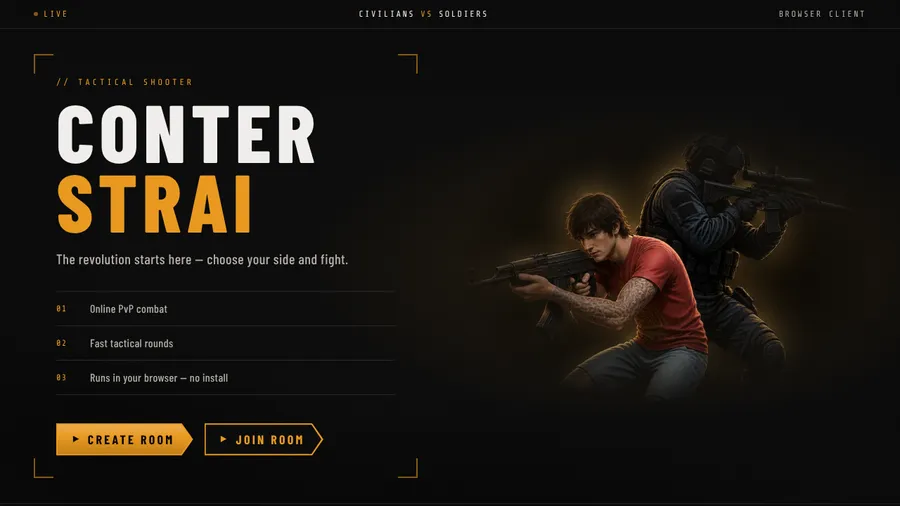

# Conter Strai

A browser tactical shooter. **Civilians** vs **Soldiers**, round-based team fights — no game client to install.



> The revolution starts here — choose your side and fight.

Open it in a modern browser (Chrome, Firefox, Safari, or Edge). Play on a computer with a keyboard and mouse, or on a phone or tablet with on-screen controls.

## What it is

You pick a side, enter a room, and try to wipe the other team before they wipe you.

- **Teams:** Civilians vs Soldiers (up to 4 per side, 8 players total)
- **Mode:** Team elimination — no respawn until the next round
- **Loadout:** Pistol only
- **Map:** One arena for now (`arena-01`)
- **Host:** The person who creates the room starts and restarts rounds

Friends join with a room code, an invite link, or a QR code from the waiting room.

## Status

**Playable.** Create a room, invite people, and fight. Next up is more arena polish — see the [changelog](./specs/CHANGELOG.md).

## Run it on your computer

You need [Node.js 20 or newer](https://nodejs.org) (the project is developed on 24). Then in a terminal, from this folder:

```bash
npm install
npm run build
npm run preview
```

Open [http://localhost:4321](http://localhost:4321). **Create Room** to host, or **Join Room** if someone already has a code.

Leave the terminal window open while you play. Press `Ctrl+C` when you want to stop the server.

If you are changing the code, use the dev workflow in [CONTRIBUTING.md](./CONTRIBUTING.md) instead.

## Host a LAN party

One computer runs the game. Everyone else only needs a browser on the same Wi-Fi.

1. On the **host** computer, start the server as above (`npm install`, then `npm run build`, then `npm run preview`).
2. Find that computer’s local address (not `localhost`):
   - **macOS:** System Settings → Wi-Fi → Details → TCP/IP
   - **Windows:** `ipconfig` in Command Prompt — look for **IPv4 Address**
   - **Linux:** `hostname -I`
3. On the host, open the game with that address, for example `http://192.168.1.23:4321` — not `http://localhost:4321`. Invite links and the QR code copy whatever address you used.
4. Create a room. Share the invite link, the QR code, or the 6-character room code.
5. Friends open the same address (or the invite link) in their browser, pick a team, and join. When everyone is in, the host starts the match.

If friends cannot connect:

- Stay on the same Wi-Fi (guest / “client isolation” networks often block this).
- Allow incoming connections on port **4321** in the host firewall (macOS and Windows may prompt the first time).
- Everyone must use the host’s LAN address, not `localhost`.

Rooms time out after 40 minutes if nobody starts or restarts a round.

## Controls

### Desktop (keyboard and mouse)

| Key   | Action                                                         |
| ----- | -------------------------------------------------------------- |
| WASD  | Move                                                           |
| Space | Sprint                                                         |
| Mouse | Look / shoot (left click)                                      |
| Q     | Jump                                                           |
| Shift | Kneel                                                          |
| R     | Reload                                                         |
| C     | Cycle camera (first person / over the shoulder / third person) |
| Esc   | Pause                                                          |

Camera mode can also be cycled from the pause menu.

### Touch (phones and tablets)

On a **touch-primary** device (phone or tablet), `/play` shows on-screen controls. No keyboard, mouse, or pointer-lock prompt is required.

| Control                         | Action                                                         |
| ------------------------------- | -------------------------------------------------------------- |
| Left joystick                   | Move                                                           |
| Drag the right half of the screen | Look                                                         |
| Fire button                     | Shoot                                                          |
| **A** (hold)                    | Sprint                                                         |
| **B** (tap)                     | Kneel                                                          |
| Menu (top-left)                 | Pause                                                           |
| Pause menu → Cycle camera       | First person / over the shoulder / third person                 |

Jump, reload, and an in-game camera button are not on the overlay — camera changes from the pause menu.

## Contributing

Want to help with code, design, or docs? Read [CONTRIBUTING.md](./CONTRIBUTING.md) first — workflow, layout, and commands for developers live there.

**AI / agent contributors:** start at [`AGENTS.md`](./AGENTS.md).

## License

[Apache License 2.0](./LICENSE)
