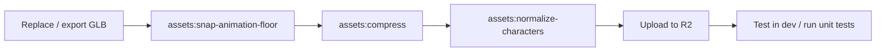
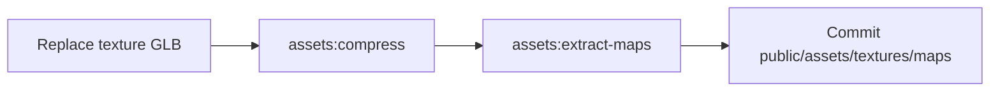

# Asset pipeline

Scripts under `scripts/` prepare GLBs in `assets/glb/` before they are loaded in-game (locally via `/api/mock/local-glb`, in production from [Cloudflare R2](../assets/glb/README.md)).

All asset npm scripts run from the repo root:

```bash
npm run assets:<name>
```

GLB files are tracked with **Git LFS**. After changing binaries, commit the LFS objects and upload updated keys to R2 before expecting production to pick them up — see [Updating GLBs on Cloudflare](../assets/glb/README.md#updating-glbs-on-cloudflare).

## Quick reference

| Script               | npm command                           | When to run                                                                                  |
| -------------------- | ------------------------------------- | -------------------------------------------------------------------------------------------- |
| Compress / optimize  | `npm run assets:compress`             | After replacing any GLB, or when embedded textures are larger than 1K                        |
| Normalize characters | `npm run assets:normalize-characters` | After compressing character or shared-animation GLBs, or after a fresh Mixamo export         |
| Snap animation floor | `npm run assets:snap-animation-floor` | After changing action clips in shared animation packs (jump, kneel, dying, lobby preview, …) |
| Extract texture maps | `npm run assets:extract-maps`         | After changing floor/wall texture source GLBs under `assets/glb/textures/`                   |

## Recommended order

Different asset types follow different paths.

### Character meshes and shared animation packs

Use this when you edit `assets/glb/characters/**` (skins, `base-animations.glb`, `character-preview-animation.glb`).



1. **Snap floor** — only needed for shared animation GLBs when action clips change (see below). Skip for skin-only mesh edits.
2. **Compress** — downscales embedded textures to 1K in place.
3. **Normalize** — fixes Mixamo bone prefixes, glossiness-as-MR maps, and body alpha mode. Run **after** compress so material edits are not overwritten.
4. **Upload** changed keys to R2 for production.

### Scenario texture sources

Use this when you edit `assets/glb/textures/floor/*` or `assets/glb/textures/wall/*`.



Extracted maps land in `public/assets/textures/maps/` and are served directly by the app (not R2).

### Props and environment GLBs

Jacaranda, road barrier, covered car, and similar props: run **`assets:compress`** only (geometry LOD strip + WebP textures). No normalize or snap step.

---

## `assets:compress`

**Script:** `scripts/compress-assets.mjs`

**Purpose:** Shrink GLB file size — resize embedded textures to **1024×1024**, optionally strip extra LODs, simplify heavy geometry, and quantize attributes.

**When to run:**

- After dropping in a new or re-exported GLB
- Before committing large texture or character assets
- When CI or local dev feels slow loading a specific model

**Default (no arguments)** processes:

- All **resize targets** — texture source GLBs, character meshes, `base-animations.glb`, `pistol_a.glb`
- **Jacaranda** — keeps `jacaranda_tree_LOD1`, simplifies foliage, WebP 1K
- **Concrete road barrier** — keeps `concrete_road_barrier_LOD1`
- **Covered car** — texture compress + quantize only

**Examples:**

```bash
# Full pass (typical after bulk asset updates)
npm run assets:compress

# Single file
npm run assets:compress -- assets/glb/characters/civilians/remy.glb

# Prop-specific (matched by path substring)
npm run assets:compress -- assets/glb/greenery/jacaranda.glb
npm run assets:compress -- assets/glb/Infrastructure/concrete_road_barrier.glb
npm run assets:compress -- assets/glb/Infrastructure/covered_car.glb
```

Writes **in place**. Missing files are skipped with a warning.

---

## `assets:normalize-characters`

**Script:** `scripts/normalize-character-glbs.mjs`

**Purpose:** Enforce the shared Mixamo / PBR contract:

1. Rename numbered bone prefixes (`mixamorig9:` → `mixamorig:`)
2. Remove glossiness textures miswired as `metallicRoughness`; set cloth-like roughness (`0.75`)
3. Force body materials from `BLEND` to `OPAQUE` (hair / lashes stay blended)

**When to run:**

- After **`assets:compress`** on character GLBs
- After a fresh Mixamo export (before merging into the repo)
- When unit tests fail on skeleton contract (`mixamorig:Hips`, no `mixamorig\d+:`)

**Default targets** (no arguments):

- `characters/civilians/{remy,liza,james}.glb`
- `characters/soldiers/{swat-1,swat-2,swat-3}.glb`
- `characters/shared/base-animations.glb`
- `characters/shared/character-preview-animation.glb`

**Examples:**

```bash
npm run assets:normalize-characters

# One skin
npm run assets:normalize-characters -- assets/glb/characters/civilians/remy.glb
```

Skips files that are already normalized. Writes **in place**.

---

## `assets:snap-animation-floor`

**Script:** `scripts/snap-animation-floor.mjs`

**Purpose:** Adjust Mixamo **hips translation** keyframes so poses sit on **Y = 0**. Mixamo exports often leave crouch, death, kneel, and jump clips floating above the floor. Locomotion clips (`walk`, `run`, …) have hips stripped at runtime in code and are **not** in the default preset.

**When to run:**

- After adding or re-exporting clips in **`base-animations.glb`** or **`character-preview-animation.glb`**
- When action poses (jump, kneel, dying, reload, lobby preview) look vertically offset in-game
- **Before** `assets:compress` (compress does not fix animation keys)

**Default (no arguments)** — in-place preset snap on:

| File                                                | Preset clips                                                                                                   |
| --------------------------------------------------- | -------------------------------------------------------------------------------------------------------------- |
| `characters/shared/base-animations.glb`             | `jump` (boost 1.15), `jump-idle`, `kneel`, `dying`, `reloading`, `reloading-kneel`, `hit-reaction`, `shooting` |
| `characters/shared/character-preview-animation.glb` | `figth`, `looking-around`, `looking-bihind`                                                                    |

**Examples:**

```bash
# Apply presets to both shared animation GLBs
npm run assets:snap-animation-floor

# Inspect hips Y range per clip (no writes)
node scripts/snap-animation-floor.mjs --list

# Preview changes
node scripts/snap-animation-floor.mjs --dry-run

# Single file, in place (uses preset if known)
node scripts/snap-animation-floor.mjs assets/glb/characters/shared/base-animations.glb

# Copy mode — all clips unless --clip is specified
node scripts/snap-animation-floor.mjs in.glb out.glb

# Manual per-clip tuning
node scripts/snap-animation-floor.mjs in.glb out.glb \
  --clip dying --auto \
  --clip jump --auto --boost 1.15 \
  --clip kneel --y-offset 9.55
```

**Flags:**

| Flag             | Effect                                                                |
| ---------------- | --------------------------------------------------------------------- |
| `--list`         | Print hips Y min/max per animation; exit                              |
| `--dry-run`      | Log what would change; do not write                                   |
| `--clip <name>`  | Target one animation (repeatable)                                     |
| `--auto`         | Floor-anchor mode: shift min Y to 0, optionally scale arc (`--boost`) |
| `--y-offset <n>` | Manual delta on every hips Y keyframe                                 |
| `--boost <n>`    | With `--auto`, scale height above floor (default `1`)                 |

---

## `assets:extract-maps`

**Script:** `scripts/extract-texture-maps.mjs`

**Purpose:** Extract PBR images from texture source GLBs into **`public/assets/textures/maps/<id>/`** with a `manifest.json` consumed at runtime.

**When to run:**

- After changing any file under `assets/glb/textures/floor/` or `assets/glb/textures/wall/`
- After **`assets:compress`** on those texture GLBs (extract reads the compressed source)

**Sources (fixed list):**

| ID                    | Source GLB                              |
| --------------------- | --------------------------------------- |
| `forrest_ground`      | `textures/floor/forrest_ground.glb`     |
| `asphalt`             | `textures/floor/asphalt.glb`            |
| `brown_floor_tiles`   | `textures/floor/brown_floor_tiles.glb`  |
| `castle_brick_broken` | `textures/wall/castle_brick_broken.glb` |
| `broken_brick`        | `textures/wall/broken_brick.glb`        |
| `cliff_side`          | `textures/wall/cliff_side.glb`          |

**Example:**

```bash
npm run assets:extract-maps
```

No CLI arguments — always processes the full list. Commit the updated files under `public/assets/textures/maps/`.

---

## Validation

After asset changes:

```bash
npm run test:unit
```

Relevant tests include `tests/units/soldiers/soldier-assets.test.ts` (shared clip names, skeleton contract) and `tests/units/scenarios/resolve-soldier-clips.test.ts` (clip resolve + hips strip).

Spot-check in dev:

```bash
PUBLIC_COLYSEUS_URL=ws://localhost:2567 npm run dev
```

Open create/join room for lobby preview animations, then `/room/<id>/play` for in-game locomotion and action poses.

---

## What lives where

| Location                           | Role                                                                |
| ---------------------------------- | ------------------------------------------------------------------- |
| `assets/glb/`                      | Source GLBs (Git LFS); served via R2 in production                  |
| `public/assets/textures/maps/`     | Extracted PBR maps from texture GLBs                                |
| `public/assets/characters/sounds/` | Game audio (`.m4a`) — not processed by these scripts                |
| `src/modules/*/…` registries       | Reference CDN paths via `glbCdnUrl()` — no manual copy to `public/` |

See also [assets/glb/README.md](../assets/glb/README.md) for CDN URL mapping and R2 upload steps.
