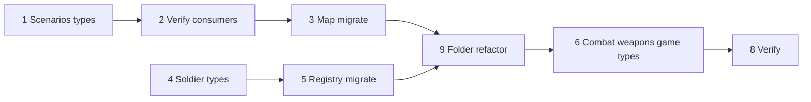

# Architecture — Type split tasks

Introduce a three-domain type architecture (scenario/arena, soldier entity, skin/hitbox) adapted to module-colocated registries. Migrate existing `ScenarioConfig` and `SoldierDefinition` without changing runtime behavior.

Design reference: [types.md](./types.md).

**Folder convention:** one `types.ts` per module (matches `textures/`, `teams/`, `props/`). See [types.md — Folder layout](./types.md#folder-layout-target) and §9 refactor.

MVP scope: no AI stubs, no objectives manager, no soldier classes, no deprecated aliases — rename cleanly in one pass.

---

## 1. Scenarios — type split

Target: single [`src/modules/scenarios/types.ts`](../../src/modules/scenarios/types.ts) with comment sections (Layout / Spawns / Environment / Config).

- [x] Types defined: `ArenaLayout`, floor/wall/prop types, `CollisionSegment`, `SpawnerConfig`, `ArenaEnvironment`, `ScenarioConfig` flat composition
- [x] **Consolidate** from `scenarios/types/` multi-file split → one `types.ts` (§9)

**Cut for MVP:** no objectives, hazards, fog/skybox stubs.

---

## 2. Scenarios — verify consumers

Compile check only — confirms flat `ScenarioConfig` composition is backward-compatible. This is **not** map/registry migration (see §3).

- [x] Confirm all scenario consumers compile unchanged (`scenario.bounds`, `teamSpawns`, etc.)
  - `scenario-scene.tsx`, `scenario-floor.tsx`, `scenario-walls.tsx`, `scenario-soldiers.tsx`
  - `use-fps-controls.ts`, `fps-controls.tsx`
  - `spawn-helpers.ts`, `get-scenario-texture-ids.ts`, `use-scenario-texture-library.ts`
  - `scenario-registry.ts`, `maps/arena-01/index.ts`
- [x] Grep: imports resolve to module `types.ts` (after §9 refactor)

**Note:** With flat composition, `arena-01/index.ts` does **not** require a structural change for MVP — the existing flat object satisfies `ScenarioConfig`. §3 covers explicit map authoring and collision data.

---

## 3. Scenarios — map & registry migration

Update map data, registries, and authoring helpers — not just type-check consumers.

- [x] Update `maps/arena-01/layout.ts` + `pieces/*` imports → `scenarios/types.ts`
- [x] Confirm `scenario-registry.ts` + `maps/index.ts` exports unchanged (keep `ScenarioId` / `ScenarioConfig`; no `arena-registry` rename in MVP)
- [x] **(Optional)** Refactor `maps/arena-01/index.ts` to compose from named sub-objects:

  ```typescript
  export const arena01: ScenarioConfig = {
    ...arena01Meta,
    ...arena01Layout,
    ...arena01Spawns,
    ...arena01Environment,
    props: [],
  };
  ```

  Same runtime shape; clearer authoring when a second map lands.

- [x] Add `collisionSegments` for `arena-01` (or `buildCollisionSegments(wallSegments, houses)` helper)
  - Derive from `wallSegments` + house doorway hole metadata
  - Feeds US-2 interior wall collision
- [x] Add `scenario-registry.test.ts` (Vitest) — bounds, spawn sides, texture ids

---

## 4. Soldiers — type split

Target: single [`src/modules/soldiers/types.ts`](../../src/modules/soldiers/types.ts) with comment sections (Skin / Hitbox / Controller / Entity).

- [x] Types defined: `CharacterMeshData`, `SoldierSkin`, `HitboxPreset`, `SoldierController`, `EntityId`, `Soldier`
- [x] **Consolidate** from `soldiers/types/` multi-file split → one `types.ts` (§9)

**Cut for MVP:** no class, voice, or AI controller types.

---

## 5. Soldiers — registry & consumer migration

- [x] `soldierSkins` + `hitboxPresets` in registry with `meshData` + `hitboxPresetId`
- [x] `getSoldierSkinById`; `SoldierSkinId` replaces `SoldierId`
- [x] `SoldierModel`, `FpsViewModel`, locomotion utils use `skin.meshData`
- [x] **Split registries** into separate files at module root (§9):
  - `soldier-skin-registry.ts`
  - `hitbox-preset-registry.ts`
- [x] Remove dead `get-soldier-by-id.ts` / `SoldierDefinition` if any references remain

---

## 6. Combat, weapons, game — types only

Add `types.ts` **with the first runtime file** in each module — no empty module shells.

- [x] `combat/types.ts` + `apply-damage.ts` (US-3) — `DamageData`, `HealthState`, `HealthSystem`
  - `DamageData`: `attackerId`, `targetId`, `zone`, optional `weaponId`, `team`
- [x] `weapons/types.ts` + pistol config (US-4) — `BulletHitResult`, `PistolWeaponConfig`, `Loadout`
- [x] `game/types.ts` — `GameMode` (`'team-elimination'`), `RoundPhase` (before round service)

No `types/` subfolders or barrel-only modules.

---

## 7. Documentation

- [x] Link [types.md](./types.md) from [specs/current/design.md](../current/design.md) module map section
- [x] Link from [specs/current/tasks.md](../current/tasks.md)

---

## 8. Verification

- [x] `npm run build` passes
- [x] `npm run dev` — arena-01 renders; NPC soldiers + FPS view model unchanged
- [x] `soldier-skin-registry.test.ts` (née `soldier-registry.test.ts`) — `swat-guy` → `meshData.modelUrl`, clip names, `hitboxPresetId`

---

## 9. Folder structure refactor

Consolidate multi-file `types/` folders to single `types.ts` per module. Logical domains stay as **comment sections**, not separate files.

### Scenarios

- [x] Merge `scenarios/types/{layout,spawner,environment,arena,index}.ts` → `scenarios/types.ts`
- [x] Delete `scenarios/types/` directory
- [x] Update imports: `../types`, `@/modules/scenarios/types` → resolve to `types.ts`
- [x] Confirm `scenarios/index.ts` still `export * from './types'`

### Soldiers

- [x] Merge `soldiers/types/{skin,hitbox,controller,entity,index}.ts` → `soldiers/types.ts`
- [x] Delete `soldiers/types/` directory
- [x] Update imports across `soldiers/` and `game/components/fps-view-model.tsx`
- [x] Extract `hitbox-preset-registry.ts` from `soldier-registry.ts` (optional but recommended)
- [x] Rename `soldier-registry.ts` → `soldier-skin-registry.ts` (optional; update imports)

### Acceptance

- [x] Each module has at most one `types.ts` (no `types/` folder)
- [x] Same exported type names — refactor is move-only, no API change
- [x] `npm run build` passes after consolidation

**When to re-split:** only if a `types.ts` grows past ~200 lines or a second map/class/weapon family needs clear ownership.

---

## Out of scope

- Runtime `Arena` class, AI controller, hazards, weapon firing, health store
- Renaming `scenarios/` module to `arena/`
- Nested `scenario.layout.bounds` refactor
- Colyseus Schema types (US-5)
- Soldier classes, objectives manager, voice packs, skin customization

---

## Dependency order



§9 can run as soon as §1 and §4 types are stable. §6 waits for US-3/4 runtime files. §3 `collisionSegments` aligns with [specs/us-2/tasks.md](../us-2/tasks.md).
