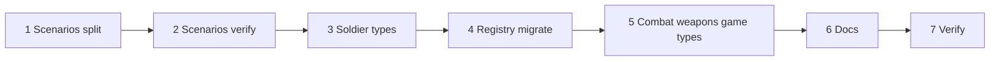

# Architecture — Type split tasks

Introduce a three-domain type architecture (scenario/arena, soldier entity, skin/hitbox) adapted to module-colocated registries. Migrate existing `ScenarioConfig` and `SoldierDefinition` without changing runtime behavior.

Design reference: [types.md](./types.md).

MVP scope: no AI stubs, no objectives manager, no soldier classes, no deprecated aliases — rename cleanly in one pass.

---

## 1. Scenarios — type split

Create `src/modules/scenarios/types/`:

- [ ] `layout.ts` — `ArenaLayout`, floor/wall/prop types, `CollisionSegment` (for US-2 interior wall collision)
- [ ] `spawner.ts` — `SpawnerConfig`, `SpawnPoint`
- [ ] `environment.ts` — `ArenaEnvironment` (`lighting` only for MVP)
- [ ] `arena.ts` — `ScenarioConfig` as flat composition (`ScenarioMeta & ArenaLayout & SpawnerConfig & ArenaEnvironment`)
- [ ] `index.ts` — barrel; replace monolithic `scenarios/types.ts` with thin re-export

**Cut for MVP:** no `objectives.ts`, no hazards/interactives/fog/skybox stubs.

---

## 2. Scenarios — verify consumers

- [ ] Confirm all scenario consumers compile unchanged (`scenario.bounds`, `teamSpawns`, etc.)
  - `scenario-scene.tsx`, `scenario-floor.tsx`, `scenario-walls.tsx`, `scenario-soldiers.tsx`
  - `use-fps-controls.ts`, `fps-controls.tsx`
  - `spawn-helpers.ts`, `get-scenario-texture-ids.ts`, `use-scenario-texture-library.ts`
  - `scenario-registry.ts`, `maps/arena-01/index.ts`
- [ ] Grep: no imports bypass the `types/` barrel

---

## 3. Soldiers — type split

Create `src/modules/soldiers/types/`:

- [ ] `skin.ts` — `CharacterMeshData`, `SoldierSkin`, `SoldierSkinId`, `SoldierAnimationClips`
- [ ] `hitbox.ts` — `HitZone`, `HitboxPreset`, `HitboxPresetId`
- [ ] `controller.ts` — `LocomotionIntent`, `LocomotionState`, `SoldierController`, `PlayerController`
- [ ] `entity.ts` — `EntityId`, `Soldier` entity shell (id, team, skinId)
- [ ] `index.ts` — barrel; replace monolithic `soldiers/types.ts`

**Cut for MVP:** no `class.ts`, no voice/customization stubs, no AI controller types.

---

## 4. Soldiers — registry & consumer migration

- [ ] Split `soldier-registry.ts`:
  - `soldierSkins: Record<SoldierSkinId, SoldierSkin>` with `meshData` + `hitboxPresetId`
  - `hitboxPresets: Record<HitboxPresetId, HitboxPreset>` — `humanoid-standard` stub for US-3
- [ ] Rename `getSoldierById` → `getSoldierSkinById`; update `SoldierId` → `SoldierSkinId`
- [ ] Update `SoldierModel` — read from `skin.meshData` (`modelUrl`, `scale`, `animations`)
- [ ] Update `FpsViewModel` — read from `skin.meshData` (`modelUrl`, `viewModelScale`, `scale`)
- [ ] Update `use-soldier-locomotion.ts`, `resolve-soldier-clips.ts` imports
- [ ] Update `soldiers/index.ts` exports

---

## 5. Combat, weapons, game — types only

- [ ] `src/modules/combat/types/health.ts` — `DamageData`, `HealthState`, `HealthSystem`
  - `DamageData`: `attackerId`, `targetId`, `zone`, optional `weaponId`, `team`
  - Align with [specs/us-3/design.md](../us-3/design.md)
- [ ] `src/modules/weapons/types/weapon.ts` — `BulletHitResult`, `PistolWeaponConfig`, `Loadout`
  - Align with [specs/us-4/design.md](../us-4/design.md)
- [ ] `src/modules/game/types/round.ts` — `GameMode` (`'team-elimination'`), `RoundPhase`
- [ ] Barrel `index.ts` for each new module

No runtime implementations in this task — interfaces only.

---

## 6. Documentation

- [ ] Link [specs/architecture/types.md](./types.md) from [specs/current/design.md](../current/design.md) module map section
- [ ] Link from [specs/current/tasks.md](../current/tasks.md)

---

## 7. Verification

- [ ] `npm run build` passes
- [ ] `npm run dev` — arena-01 renders; NPC soldiers + FPS view model unchanged
- [ ] Add `soldier-registry.test.ts` (Vitest) — assert `swat-guy` skin resolves `meshData.modelUrl`, clip names, `hitboxPresetId`
  - Depends on US-2 Vitest setup; skip if config not landed yet, but leave task open

---

## Out of scope

- Runtime `Arena` class, AI controller, hazards, weapon firing, health store
- Renaming `scenarios/` module to `arena/`
- Nested `scenario.layout.bounds` refactor
- Colyseus Schema types (US-5)
- Soldier classes, objectives manager, voice packs, skin customization

---

## Dependency order

Tasks 5 can run in parallel with 3–4 once soldier `EntityId` / `HitZone` shapes are settled.
