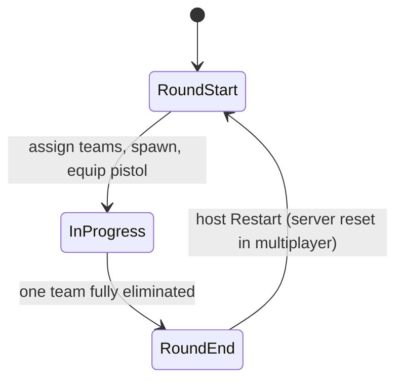
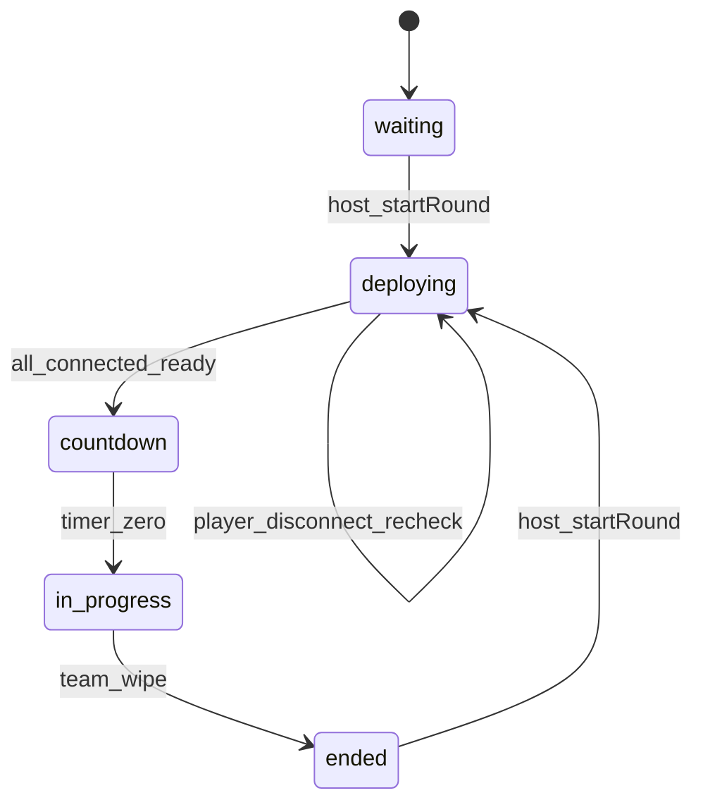
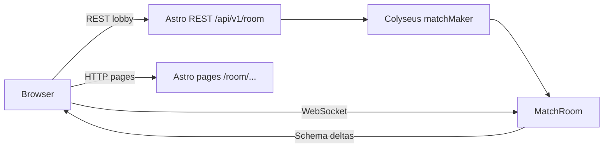

# Conter Strai — Design (current)

## Stack

- **Astro 7** — pages, layout; **Node.js adapter** (`@astrojs/node`, `output: 'server'`) for multiplayer
- **Three.js** via **@react-three/fiber** + **drei** — game island on `/room/{id}/play`
- **Zustand** — game session, health, players, round state
- **Tailwind 4** — landing UI + HUD
- **[Colyseus](https://colyseus.io/framework/)** — real-time rooms, Schema sync, matchmaking

## Game loop (round-based)



| Phase           | Behavior                                                                                                  |
| --------------- | --------------------------------------------------------------------------------------------------------- |
| **Round start** | Split players into Civilians / Soldiers; teleport to team spawns; full HP; equip pistol                   |
| **In progress** | PvP combat; eliminated players spectate or wait (no respawn)                                              |
| **Round end**   | One team wiped → opposing team wins; show banner. Next-round reset is server-authoritative in multiplayer |

## Teams

| Team      | ID         | Motif                                                                            |
| --------- | ---------- | -------------------------------------------------------------------------------- |
| Civilians | `civilian` | Irregular / non-military side — default play skin `remy` (also `james` / `liza`) |
| Soldiers  | `soldier`  | Military side — `swat-1` / `swat-2` / `swat-3`                                   |

Team IDs are `civilian` \| `soldier` everywhere in code. Display names: **Civilians** / **Soldiers** (`TEAM_DISPLAY_NAME`).

Team assignment: random or balanced split in MVP; **server assigns teams** in Colyseus `MatchRoom`.

## Weapons (loadout)

| Weapon | MVP                       | Future            |
| ------ | ------------------------- | ----------------- |
| Pistol | Yes — default round start | —                 |
| Knife  | No                        | Melee, silent     |
| Rifle  | No                        | Primary weapon    |
| Others | No                        | SMG, sniper, etc. |

Weapon registry lives in `src/modules/weapons/` (`weapon-registry.ts`, `PistolWeaponConfig`). Pistol mesh attaches at runtime to the Mixamo right-hand bone (`WeaponAttach`); do not bake weapons into character mesh GLBs.

## Module map

```
src/
├── pages/index.astro     Landing (hero, CTA, GitHub footer) — Astro-only
├── pages/room/           Create / join / wait / play (US-7)
├── components/           Shared Astro UI (GithubIcon, …)
├── modules/
│   ├── lobby/            Room session, create/join/wait islands, invite share + QR
│   ├── game/             Session shell, GameCanvas, FPS controls, HUD, round state
│   ├── scenarios/        Config-driven maps (arena-01); team spawn points
│   ├── soldiers/         Skin registry, model, locomotion
│   ├── combat/           Hitboxes, HP, zone damage, difficulty
│   ├── weapons/          Loadout, pistol (MVP); knife/rifle later
│   └── multiplayer/      Colyseus adapter + MatchRoom / Schema
├── layouts/              Base shell (SEO, fonts, atmosphere)
└── styles/               Design tokens + landing/HUD utilities
```

## Module types

One `types.ts` per module (same as `textures/`, `teams/`, `props/`). Registries at module root; no `types/` subfolders until a file exceeds ~200 lines.

```
src/modules/
├── scenarios/types.ts          ScenarioConfig (flat composition), ArenaLayout, spawns
├── soldiers/types.ts           SoldierSkin, controller, entity (hitboxPresetId only)
├── soldiers/soldier-skin-registry.ts
├── combat/types.ts             HitZone, HitboxPreset, DamageData, HealthSystem
├── combat/hitbox-preset-registry.ts
├── combat/apply-damage.ts
├── weapons/types.ts            PistolWeaponConfig, BulletHitResult, Loadout
└── game/types.ts               GameMode, RoundPhase
```

| Domain       | Key types                                                          | Notes                                                         |
| ------------ | ------------------------------------------------------------------ | ------------------------------------------------------------- |
| **Scenario** | `ScenarioConfig`, `ArenaLayout`, `SpawnerConfig`                   | Flat access (`scenario.bounds`); maps under `scenarios/maps/` |
| **Soldier**  | `SoldierSkin`, `CharacterMeshData`, `Soldier`, `SoldierController` | Visual preset decoupled from hitbox via `hitboxPresetId`      |
| **Combat**   | `HitboxPreset`, `HitZone`, `DamageData`, `HealthSystem`            | Owns collider presets and raycast zones                       |
| **Weapons**  | `PistolWeaponConfig` / `WeaponConfig`, `Loadout`                   | Per-weapon `damageByZone`; combat applies × difficulty        |
| **Game**     | `GameMode`, `RoundPhase`                                           | `'team-elimination'`; `'live' \| 'loading' \| 'countdown' \| 'round-end'` |

Shipped 2026-08-23 — see [CHANGELOG](../CHANGELOG.md#shipped--other).

## Landing (`/`)

| Piece  | Detail                                                                                                                             |
| ------ | ---------------------------------------------------------------------------------------------------------------------------------- |
| Files  | `src/pages/index.astro`, `src/layouts/base-layout.astro`, `src/components/GithubIcon.astro`, `src/styles/global.css`               |
| Layout | Full-viewport: status strip → hero (copy + CTA left, `cs.png` right) → footer; stack on mobile                                     |
| Theme  | Near-black surfaces; CS amber accent (`--accent`); `.game-atmosphere` vignette/glow; Barlow Condensed + Rajdhani + Share Tech Mono |
| CTA    | **Create Room** → `/room`; **Join Room** → `/room/join`                                                                            |
| Footer | **Contribute on GitHub** → repo from `package.json` `homepage` (opens in new tab; `GithubIcon`)                                    |
| SEO    | Title, description, OG/Twitter image (`/cs.png`), dark `theme-color`, favicon `/conter-strai.png`                                  |
| Bundle | Astro-only — no Three.js / R3F on this route                                                                                       |

## Routes

| Route                 | Owner                                           |
| --------------------- | ----------------------------------------------- |
| `/`                   | Astro landing — no Three.js                     |
| `/room`               | Create room (team / skin / arena + R3F preview) |
| `/room/join`          | Join by typed room id + team / skin             |
| `/room/[roomId]`      | Waiting room (invite URL, copy, QR, Play)       |
| `/room/[roomId]/join` | Invite join (room id from path)                 |
| `/room/[roomId]/play` | Game canvas — boot from `sessionStorage`        |

## Match lobby — shipped US-7 + US-5 REST

Pre-play lobby (`src/modules/lobby/`). **REST** (`/api/v1/room`) owns create / snapshot / seat / dispose; **Colyseus WebSocket** owns presence and play. TanStack Query polls `GET` while waiting; play connects via `colyseus-adapter`.

```
sessionStorage[`cs:room:${roomId}`] = {
  team: Team;
  skin: SoldierSkinId;
  scenario: ScenarioId;   // create: chosen; join: arena-01 until host sync
  role: 'host' | 'guest';
}
```

| Skin ↔ team                              | Defaults |
| ---------------------------------------- | -------- |
| civilian → `remy` / `james` / `liza`     | `remy`   |
| soldier → `swat-1` / `swat-2` / `swat-3` | `swat-1` |

Missing/invalid play session → `civilian` + `remy` + `arena-01` with team↔skin consistency. Invite URL is path-only: `{origin}/room/{roomId}/join`. `ScenarioConfig.previewImageUrl` optional (`arena-01` null until art). Civilian east spawn required for civilian pick.

## Play island (`/room/.../play`) — shipped US-2 + US-7 boot

Units: **1 world unit = 1 meter**.

### Registries

| Registry         | Role                                                                                | Example ids                                                     |
| ---------------- | ----------------------------------------------------------------------------------- | --------------------------------------------------------------- |
| **Texture**      | Floor/wall GLB materials under `/assets/textures/`                                  | `forrest_ground`, `coral_fort_wall`                             |
| **Prop**         | Placeable objects (trees, barrels, cover)                                           | deferred (`props: []` on arena-01)                              |
| **Scenario**     | Map layout: bounds, materials, props, team spawns                                   | `arena-01`                                                      |
| **Soldier skin** | Visual presets (`SoldierSkin`); hitbox via `hitboxPresetId`; clips from shared pack | `remy` (default), `james`, `liza`, `swat-1`, `swat-2`, `swat-3` |

`ScenarioScene` reads config only — new arena / prop = registry + placements, not a new React scene.

### Key components

- `GameCanvas` — R3F Canvas, lights, camera
- `ScenarioScene` — floor + outer walls + `wallSegments` + generic `props`
- `SoldierModel` — NPC spawns; `LocalPlayer` — one clone + mixer
- `useFpsControls` — WASD, mouse, locomotion intent, collision
- `useShooting` — camera-center pistol hitscan, cooldown, no friendly fire
- `useSoldierLocomotion` — idle / walk / run / crouch-walk + jump / kneel / reload / dying
- `CameraHud` / `CrosshairHud` — mode label + screen crosshair; world aim marker on look-ray hit

### Camera modes (**C**)

Default on play boot: **over-the-shoulder**. Cycle with **C**: FPS → OTS → TPS → …

| Mode                  | Role                                                                                                   |
| --------------------- | ------------------------------------------------------------------------------------------------------ |
| **First-person**      | Camera on head bone; head mesh hidden; spine pitch follows look; same clone (no view-model)            |
| **Over-the-shoulder** | Close behind right shoulder (~1.75 m back, ~1.55 m up) — **default**                                   |
| **Third-person**      | Farther behind/above (~3.6 m back, ~2.4 m up)                                                          |
| **Free (dev)**        | **V** toggles; ghost fly (WASD + click-to-look, Q/E up/down, Shift boost); no collision; player frozen |

Shared hot-path state: `origin`, `yaw`, `pitch`, `mode` (`game/state/player-state.ts`). OTS/TPS boom height rides head-bone world Y after mixer update. Free-cam + Playwright probe live under `game/dev/` and are **lazy-loaded only when `import.meta.env.DEV`** (absent from production bundles). Production pauses for any R3F `controls` owner — no free-cam import.

### Locomotion / actions

| Input              | Clip                     | Notes                                                                               |
| ------------------ | ------------------------ | ----------------------------------------------------------------------------------- |
| Stand still        | `idle`                   | Default                                                                             |
| WASD               | `walk`                   | In-place; hips translation stripped                                                 |
| WASD + Space       | `run`                    | Faster move + run clip                                                              |
| **S**              | `walk-backward`          | ~70% walk speed; dominant backpedal (`forward < 0` and `\|forward\| >= \|strafe\|`) |
| **S** + Space      | `run-backward`           | ~60% run speed; backpedal clip                                                      |
| **E**              | `kneel`                  | Toggle; `LoopOnce` + clamp; WASD does **not** clear kneel                           |
| Kneel + WASD       | `crouch-walking`         | Loop; walk-speed; kneel pose kept                                                   |
| Kneel + WASD+Space | `run`                    | Run speed + stand run clip; kneel pose kept → resumes on stop                       |
| Kneel + S          | `crouch-walking` / `run` | No crouch-backward clip; falls back to crouch-walk or run-over-kneel                |
| **F** (idle/kneel) | `jump-idle`              | In-place one-shot; no Y physics; kneel lifts on keypress                            |
| **F** (walk/run)   | `jump`                   | Forward one-shot; clears kneel first                                                |
| **R**              | `reloading`              | One-shot; stand+idle or `reloading-kneel`; WASD cancels                             |
| **LMB**            | —                        | Hitscan pistol (no `shooting` pose until a shippable clip)                          |
| **Esc** (live)     | —                        | Toggle pause menu; releases look; no pause during **`loading`** / **`countdown`**     |

Priority: blocking one-shots (`reloading` / `reloading-kneel` > `jump` / `jump-idle`) → kneel + run → run → kneel + walk → crouch-walk → kneel + idle → locomotion run-backward / walk-backward → walk / run → idle → **`dying`** on elimination. Optional `shooting` is mixer-ready but not triggered.

### Interior collision

Axis-aligned segments from house footprints; doorway holes via `WALL_HOLE_WIDTH`. Player circle (`PLAYER_RADIUS`) vs segments after intended move; outer bounds clamp last.

### arena-01 — Ruined Village

| Field      | Value                                                    |
| ---------- | -------------------------------------------------------- |
| **bounds** | 100 m × 50 m; wall height 3.5 m                          |
| **floor**  | `forrest_ground`                                         |
| **walls**  | `coral_fort_wall` perimeter + interior ruin segments     |
| **spawns** | Soldiers west (−X), Civilians east (+X); face map center |
| **props**  | `[]` — slots ready for trees / cover later               |

### Testing

| Layer          | Scope                                                                                                                           |
| -------------- | ------------------------------------------------------------------------------------------------------------------------------- |
| **Vitest**     | Registries; shared-pack + mesh Armature contract; clip resolve / hips strip; kneel→crouch-walk; locomotion; collision; FPS hide |
| **Playwright** | Room play (`remy` / `swat-1`); no `PropertyBinding` errors; kneel + WASD stays crouched; camera cycle without pre-click; pause menu; deploy-before-countdown; optional `__PLAY_TEST__` hook          |

## Characters — shipped US-6

Locomotion and action clips load from `/assets/characters/shared/base-animations.glb`. Mesh GLBs are skins only.

| Skin ids                     | Team     | Mesh path                               |
| ---------------------------- | -------- | --------------------------------------- |
| `remy`, `james`, `liza`      | civilian | `/assets/characters/civilians/<id>.glb` |
| `swat-1`, `swat-2`, `swat-3` | soldier  | `/assets/characters/soldiers/<id>.glb`  |

Default play skin from session is `remy` (civilian, east spawn) when unset; non-default skins come from room session on `/room/{roomId}/play`.

**Skeleton contract:** Mixamo `Armature` with bone names `mixamorig:*` (colon form). Vendor exports with numbered prefixes (`mixamorig9:`, …) are rewritten in-asset (`npm run assets:normalize-characters`) so shared-pack tracks and aim/FPS lookups bind.

**Required shared clips:** `idle`, `walk`, `run`, `jump`, `jump-idle`, `kneel`, `crouch-walking`, `walk-backward`, `run-backward`, `dying`, `reloading`, `reloading-kneel`. Optional: `shooting` (deferred — not played on LMB), `hit-reaction`. Backward locomotion clips have hips translation stripped.

**Clip resolve:** `useGLTF` mesh + shared pack; merge lists (**shared wins** on name); resolve by registry names (null if a required clip is missing); strip hips translation on `idle` / `walk` / `run` / `crouch-walking`.

**Removed:** `/assets/soldiers/swat-soldier.glb` and skin id `swat-guy`.

## Combat — shipped US-3

### Damage

```
damage = maxHp × weapon.damageByZone[zone] × DIFFICULTY_MULT[difficulty]
nextHp = max(0, currentHp − damage)
```

| Weapon   | head | body | limb | Status                         |
| -------- | ---- | ---- | ---- | ------------------------------ |
| `pistol` | 0.40 | 0.20 | 0.15 | MVP — only equipped weapon now |
| `knife`  | TBD  | TBD  | TBD  | Future loadout                 |

- **Weapons own** per-zone fractions on `weapon-registry.ts`; **combat** owns pure `applyDamage` + `DIFFICULTY_MULT` — no Three.js in the service.
- **Health store** (`health-store.ts`, Zustand): per-`EntityId` HP map; resolves `weaponId` → profile; sets `isEliminated` via `isEliminated(hp)`.
- HP resets on round end only (`resetAll` in the round service).

### Hitboxes

Invisible meshes from `HitboxPreset.parts` (`humanoid-standard`); each part tagged `userData.hitZone` + `userData.entityId`. Skins reference preset via `hitboxPresetId` only — no geometry on skin config.

Attached on `LocalPlayer` and `SoldierModel` when `entityId` is set.

### HUD + elimination

- `HealthBar` — DOM overlay, local player HP %.
- At 0 HP: `isEliminated: true`; FPS controls disabled; **`dying`** one-shot on mixer (`LocalPlayer` / `SoldierModel` via `getPose`).
- No mid-round respawn; round reset restores HP.

### Key files

| File                                | Role                                 |
| ----------------------------------- | ------------------------------------ |
| `combat/apply-damage.ts`            | Pure zone × weapon × difficulty math |
| `combat/health-store.ts`            | Zustand `HealthSystem`               |
| `combat/components/hitbox-mesh.tsx` | Invisible zone colliders             |
| `combat/components/health-bar.tsx`  | HUD                                  |
| `weapons/weapon-registry.ts`        | Pistol `damageByZone`                |

## Data flow (combat)

```
useShooting (raycast) → hit zone from mesh userData
  → health store applyDamage → HUD
  → isEliminated → disable controls + dying clip
  → round service checks team wipe → round end → resetAll
```

## PvP loop — shipped US-4

Local team-elimination on `/room/.../play`. In multiplayer, damage, elimination, and round end are **server-authoritative** via Colyseus.

### Round service (`game/state/round-store.ts`)

```
startRound() → roster from ScenarioConfig.teamSpawns, resetAll HP, teleport local player, equip pistol
checkRoundEnd() → if all civilians eliminated OR all soldiers eliminated → endRound(winner)
endRound(winner) → RoundPhase 'round-end', winner banner with Restart / Home (no auto-restart; host or offline Restart starts the next round)
```

Local player occupies the session skin/team (default civilian `remy`); offline play fills remaining spawns with `ScenarioSoldiers` NPCs. Multiplayer disables bots — opponents are `RemotePlayer` peers.

When `HealthState.isEliminated`, FPS move/look/shoot is disabled and look is released until the next `startRound()`.

## Pause, look, deploy gate — shipped US-9

### Look capture

Browsers may reject `requestPointerLock()` without a user gesture. On mount, **`use-player-pointer-lock`** enables document-level `mousemove` look (`isLookEnabled` in `player-state.ts`); `#game-canvas` gets `cursor-none` while captured. Canvas **click** re-engages and best-effort upgrades to pointer lock (`request-pointer-lock.ts` swallows rejections). **Esc** / pause / elimination / **`round-end`** release look; re-engage when phase returns to **`live`** and player is alive. **`use-shooting`** gates fire on `isLookEnabled()`.

### Pause menu

[`game-pause-store.ts`](../../src/modules/game/state/game-pause-store.ts) (Zustand) + [`game-pause-panel.tsx`](../../src/modules/game/components/game-pause-panel.tsx) — visible when `isPaused && phase === 'live'`. **Escape** toggles pause in [`use-player-keyboard.ts`](../../src/modules/game/hooks/use-player-controls/use-player-keyboard.ts). While paused: movement, look, shoot, and pose actions early-out via `isPausedRef` in control hooks.

| Action  | Behavior                                                                                                                                                      |
| ------- | ------------------------------------------------------------------------------------------------------------------------------------------------------------- |
| Restart | [`restart-round.ts`](../../src/modules/game/utils/restart-round.ts) — host `startMatch()` / offline `startRound`; triggers deploy gate again                  |
| Leave   | [`leave-match-to-home.ts`](../../src/modules/game/utils/leave-match-to-home.ts) — `leaveMatch`, clear session, `location.href = '/'` **without** `deleteRoom` |
| Resume  | `setPaused(false)` + re-engage look / pointer lock                                                                                                            |

Bindings listed in **Commands** come from [`game-bindings.ts`](../../src/modules/game/constants/game-bindings.ts). Pause store resets on round end / navigate away.

### Deploy-ready countdown



Server **`deploying`** sits between **`waiting`/`ended`** and **`countdown`**. Client maps server `deploying` → **`loading`** (`map-match-round-phase.ts`); movement gated during **`loading`**. REST snapshot maps `deploying` → lobby **`in_progress`** (joins stay locked).

When [`LoadingReporter`](../../src/modules/game/components/loading-reporter.tsx) clears (`onLoaderChange(null)`):

- **Multiplayer:** adapter `playerReady()` → `room.send('playerReady')`
- **Offline:** local `startRound(scenarioId)` (no immediate mount `startRound`)

Per-player `ready: boolean` on `PlayerState`; cleared on `startRound`. Countdown numeric overlay ([`countdown-banner.tsx`](../../src/modules/game/components/countdown-banner.tsx)) only during **`countdown`**; deploy copy via **`PlayLoader`** (“Deploying…”). Waiting room redirects to `/play` on **`loading`**. **`restartRound`** message + adapter for round-end / pause restart through the same gate.

### Shooting

- Pointer-locked **LMB** → `useShooting` raycast from camera center; range 100 m; cooldown `fireCooldownSeconds` (pistol 0.35 s).
- Hits need `userData.hitZone` + `userData.entityId`; friendly fire skipped via round roster.
- `resolveHitDamage` builds `DamageData` with equipped `weaponId` → health store `applyDamage`.
- Gunshot SFX at the camera for the local shooter; peers hear spatial pistol audio via `fire` relay; injury SFX is spatial on the victim (local HP via `useHealthStore`, remote HP via `multiplayerStore`). Remote walk/run loops are per-peer with the same ~40 m linear falloff.
- **`shooting` pose is not played** — mixer can resolve an optional clip, but LMB does not set the pose until a shippable fire animation is approved.

### Reload + weapon mesh

- **R** (idle) → `reloading`; **R** while kneeling → `reloading-kneel`. Busy until mixer `finished`; WASD cancels.
- `pistol_a.glb` from registry `modelUrl`; `WeaponAttach` parents a clone under `mixamorig:RightHand` with grip offset on the weapon config.

### Vitest

`resolveHitDamage` (self / friendly / zone) and `checkRoundEnd` (team wipe → winner).

## Multiplayer — shipped US-5

Hybrid: **REST for lobby lifecycle** (create / status / seat / dispose), **WebSocket for presence and play**.



- **Astro Node** serves pages and `/api/v1/room` API routes.
- **Colyseus** runs in the **same Node process** — `matchMaker` is available to Astro `APIRoute` handlers after boot.
- Lobby UI uses REST for create / snapshot / seat / dispose; waiting room and `/play` use `@colyseus/sdk` via `colyseus-adapter`.
- REST is same-origin under Astro; WebSocket uses `PUBLIC_COLYSEUS_URL` in dev; production derives `ws:` / `wss:` from the page host.

### Boot wiring

Astro `APIRoute` handlers must run only after Colyseus/`matchMaker` is initialized. If matchMaker is not ready, REST returns **`503`**.

- **Dev** (`npm run dev`): `src/modules/multiplayer/integration.ts` listens on `COLYSEUS_PORT` (default `2567`); client uses `PUBLIC_COLYSEUS_URL`.
- **Production** (`npm run build` → `npm run preview`): `src/server.ts` attaches Colyseus to the same HTTP `$PORT` as Astro.

### Hybrid responsibilities

| Concern                          | HTTP REST (`/api/v1/room…`)                            | Colyseus WebSocket                           |
| -------------------------------- | ------------------------------------------------------ | -------------------------------------------- |
| Create room + short code         | Yes — `matchMaker.createRoom`                          | Also possible via SDK `create`               |
| Read status / open team slots    | Yes — `matchMaker.query` + metadata / `remoteRoomCall` | Better live via Schema                       |
| Actually sit in the lobby / play | No — HTTP cannot hold presence                         | **Required** — `joinById` / seat reservation |
| Transform / HP / shots           | No                                                     | **Required** — Schema + messages             |

### Lobby HTTP API

Public **`ROOM_ID`** is the 6-char code from `generate-room-id.ts`, stored in Colyseus room **metadata** as `roomCode`. Cap: `maxClients: 8`, `maxPerTeam: 4`.

```typescript
interface RoomSnapshot {
  id: string; // public roomCode
  phase: 'waiting' | 'in_progress' | 'ended';
  canJoin: boolean;
  maxPerTeam: 4;
  playerCount: number;
  expiresAt: string; // ISO — room code TTL (see Security US-8)
  scenario?: string;
  teams: {
    civilian: { count: number; max: 4; open: boolean };
    soldier: { count: number; max: 4; open: boolean };
  };
}
```

| Route                         | Behavior                                                                                                                                 |
| ----------------------------- | ---------------------------------------------------------------------------------------------------------------------------------------- |
| `POST /api/v1/room`           | Creates `MatchRoom`; **`201`** `RoomSnapshot` + `hostToken`; **`403`** cross-origin; **`503`** if matchMaker not ready                   |
| `GET /api/v1/room/:roomId`    | **`200`** snapshot; **`404`** unknown/disposed; **`410`** expired                                                                        |
| `PUT /api/v1/room/:roomId`    | Seat claim while `waiting`; **`200`** `{ snapshot, reservation }`; **`403`** cross-origin; **`409`** full/wrong phase; **`410`** expired |
| `DELETE /api/v1/room/:roomId` | Host dispose; **`Authorization: Bearer <hostToken>`**; **`401`** / **`403`** / **`410`**; broadcast `roomClosed`; **`204`**              |

After REST create or PUT, client connects with `joinById` or `consumeSeatReservation` on waiting-room and/or play mount.

### Server layout

```
src/modules/multiplayer/
├── adapters/colyseus-adapter/   # initMatch, syncTransform, sendShot, sendFire, listeners
├── handlers/                    # Astro APIRoute implementations
├── rooms/match-room.ts          # waiting → deploying → countdown → in_progress → ended
├── schema/                      # MatchState, PlayerState
└── stores/multiplayer-store/
```

**One `MatchRoom`** with `roundPhase: waiting → deploying → countdown → in_progress → ended` (no separate LobbyRoom).

### Schema state

```
// PlayerState (per client.sessionId)
{ x, y, z, rotY, hp, eliminated, team, skin, ready }

// MatchState
{ players: MapSchema<PlayerState>, roundPhase, winner, countdown, scenario, maxPerTeam: 4 }
```

- `onJoin`: reject if `players.size >= 8` or team count `>= 4`; reject if `expiresAt` is past (`assertRoomJoinable`).
- REST PUT enforces the same caps before reservation.

### Client adapter

```
initMatch({ roomId, reservation?, options?, endpoint? }) → MatchHandle
syncTransform({ x, z, yaw })            // throttled ~20 Hz
sendShot({ targetId, zone })           // server ShotMessage wire shape
sendFire()                              // relay spatial gunshot SFX to peers
startMatch()                            // host-only: waiting → deploying (US-9 gate)
playerReady()                           // client deploy complete → may start countdown
restartRound()                          // host-only: ended/waiting → deploying again
onPlayerUpdate / onRoundUpdate / onLeave
```

- Transforms: server mutates player Schema in `move` handler; client sends `room.send('move', …)` throttled ~20 Hz; server drops messages exceeding max speed/delta per tick.
- Shots: `room.send('shot', { targetId, zone })`; server validates phase, teams, range, cooldown, and zone enum before `applyDamage` — clients never decide kills in multiplayer.
- Gunshot SFX: `room.send('fire')` during `in_progress`; server relays `{ sessionId }` to peers for spatial pistol audio (cosmetic only).
- Round wipe: server runs `checkRoundEnd`, mutates `roundPhase` / `winner`; clients react to Schema deltas only.

### Round sync (server-authoritative)

- Host sends `startRound` from `waiting` or `ended` → resets HP / eliminated, spawn placement, `roundPhase: 'deploying'`, clears `ready` flags, locks joins; **renews `expiresAt`** (+40 min TTL, same `hostToken`).
- Each connected client sends `playerReady` after deploy loader clears; when all connected players are ready → `countdown: 3` → `in_progress`.
- Disconnect during **`deploying`**: re-evaluate ready gate; countdown starts when remaining connected players are all ready.
- `startRound` locks joins: REST `PUT` returns `409` outside `waiting`; reserved seats still connect after lock.
- Server tracks `hostSessionId` (first joiner; reassigned on host leave).
- Team wipe → `winner`, `roundPhase: 'ended'` until host `startRound` again (no auto-timer).
- **Home** on round-end banner → host `DELETE` (bearer `hostToken`) disposes room for all; guests `leaveMatch` and exit locally. Pause **Leave** → `/` without DELETE.

### Integration

- Create/join → `POST` / `PUT` via TanStack Query; write `sessionStorage` + server room code; host stores `hostToken` on create.
- Waiting room joins early: `useMatchJoin` + `bindMatch`; `/play` reconnects via `room.reconnectionToken` after hard navigation.
- `LocalTransformSync` forwards player transform via adapter (~20 Hz coalesced).
- `useShooting` → `sendShot`; hit detection client-side; damage/elimination server-authoritative.
- `bindMatch(handle)` feeds multiplayer store; local HP mirrors into `useHealthStore`; remote HP drives spatial injury SFX.
- Bots disabled while match connected; `RoundEndBanner` reads multiplayer store in match mode.
- `RemotePlayer` reads store roster; transforms via `getState()` in `useFrame`.

### Cosmetic clip relay

Ephemeral pose relay (not Schema-authoritative): local player emits the same clip the mixer plays (`resolveAnimationClipKey(pose, locomotion)`) over `jump-idle` | `jump` | `kneel` | `crouch-walking` | `walk` | `run` | `walk-backward` | `run-backward` | `idle` | `reloading` | `reloading-kneel` | `clear`. Jump / reload flush on keydown. Peers play that clip directly. Jump one-shots stick until mixer finishes. `clear` and missing clips fall back to locomotion inferred from position deltas. `dying` / `hit-reaction` stay visual-only; `shooting` deferred.

**Remote backward inference (fallback):** when no clip has arrived, peers infer `walk-backward` / `run-backward` when position delta is mostly opposite synced `rotY` (`dot(facing, velocity) < -0.7`); otherwise forward `walk` / `run`.

### Env

| Variable              | Purpose                                                                    |
| --------------------- | -------------------------------------------------------------------------- |
| `PUBLIC_COLYSEUS_URL` | Dev WebSocket endpoint (e.g. `ws://localhost:2567`)                        |
| `COLYSEUS_PORT`       | Dev-only Colyseus listen port (default `2567`)                             |
| `ROOM_CODE_TTL_MS`    | Room lifetime from create / each `startRound` (default `2400000` = 40 min) |
| `SITE`                | Allowed origin base for lobby REST same-site guard                         |

### Security (shipped US-8)

Anonymous invite game — 6-char codes, no accounts. Hardening layered on US-5 lobby + `MatchRoom` messages:

| Layer               | Behavior                                                                                                                                                                             |
| ------------------- | ------------------------------------------------------------------------------------------------------------------------------------------------------------------------------------ |
| **Origin guard**    | `requireSameSiteOrigin` on `POST` / `PUT` / `DELETE`; `403` when `Origin`/`Referer` present and mismatched; missing headers allowed (CSRF-ish, not a substitute for host token)      |
| **Host token**      | `generateHostToken()` on create → Colyseus **metadata** + one-time create response; host `sessionStorage` (`RoomSession.hostToken`); `DELETE` compares bearer with `timingSafeEqual` |
| **Shot validation** | `applyMatchShot` — `in_progress`, alive, opposing team, ground-plane range ≤ pistol max, per-shooter cooldown, `zone` enum; shared constants in `weapons/constants/pistol.ts`        |
| **Move validation** | `moveExceedsThreshold` — max delta vs `RUN_SPEED` + hard cap; drop outliers                                                                                                          |
| **Room TTL**        | `expiresAt` on metadata + `RoomSnapshot`; `scheduleExpiry` + `renewExpiry` on `startRound`; REST **`410`** when past; WS `onJoin` rejects expired                                    |

**Deferred:** reservation-only join beyond US-5, in-app rate limits, HttpOnly sessions, server hitscan raycast, API-key proxies.

### Out of scope (US-5)

- Colyseus Cloud deployment (local / self-hosted Node first)
- Pure HTTP gameplay; custom REST-only session store
- Separate LobbyRoom → MatchRoom migration
- Schema-authoritative `pose` field (ephemeral relay used instead)
