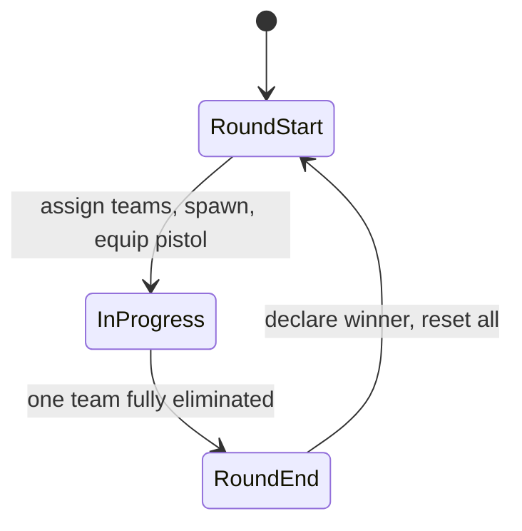

# Conter Strai — Design (current)

## Stack

- **Astro 7** — pages, layout, SSG shell
- **Three.js** via **@react-three/fiber** + **drei** — game island on `/play`
- **Zustand** — game session, health, players, round state
- **Tailwind 4** — landing UI + HUD
- **Playroom Kit** — real-time multiplayer (US-5)

## Game loop (round-based)



| Phase           | Behavior                                                                               |
| --------------- | -------------------------------------------------------------------------------------- |
| **Round start** | Split players into Argentina / England; teleport to team spawns; full HP; equip pistol |
| **In progress** | PvP combat; eliminated players spectate or wait (no respawn)                           |
| **Round end**   | One team wiped → opposing team wins; show banner; after brief delay, next round        |

## Teams

| Team      | ID          | Notes                                   |
| --------- | ----------- | --------------------------------------- |
| Argentina | `argentina` | Patches / theme align with soldiers art |
| England   | `england`   | Opposing team                           |

Team assignment: random or balanced split in MVP; host decides in Playroom (US-5).

## Weapons (loadout)

| Weapon | MVP                       | Future            |
| ------ | ------------------------- | ----------------- |
| Pistol | Yes — default round start | —                 |
| Knife  | No                        | Melee, silent     |
| Rifle  | No                        | Primary weapon    |
| Others | No                        | SMG, sniper, etc. |

Weapon registry mirrors soldier/scenario pattern (`src/modules/weapons/` — future).

## Module map

```
src/modules/
├── landing/      Hero, game info, Start Game CTA
├── game/         Session shell, GameCanvas, FPS controls, HUD, round state
├── scenario/     Config-driven maps (arena-01); team spawn points
├── soldier/      Soldier registry, model, hitboxes
├── combat/       HP, zone damage, difficulty, elimination
├── weapons/      Loadout, pistol (MVP); knife/rifle later
└── multiplayer/  Playroom adapter (US-5)
```

## Landing (`/`)

| Piece | Detail |
| ----- | ------ |
| Files | `src/pages/index.astro`, `src/layouts/base-layout.astro`, `src/modules/landing/components/LandingHero.astro`, `src/styles/global.css` |
| Layout | Full-viewport hero: copy + CTA left, `soldiers.png` right; stack on mobile |
| Theme | Near-black surfaces; CS amber accent (`--accent`); `.game-atmosphere` vignette/glow; Barlow Condensed + Rajdhani |
| CTA | **Start Game** → `/play` (high-contrast accent clip-path button) |
| SEO | Title, description, OG/Twitter image (`/soldiers.png`), dark `theme-color`, favicon `/conter-strai.png` |
| Bundle | Astro-only — no Three.js / R3F on this route |

## Routes

| Route   | Owner                                                 |
| ------- | ----------------------------------------------------- |
| `/`     | Astro landing — no Three.js                           |
| `/play` | Astro shell + R3F `GameCanvas` island (`client:load`) |

## Data flow (combat)

```
useShooting (raycast) → hit zone from mesh userData
  → applyDamage (service) → health store → HUD
  → isEliminated → disable controls (no respawn this round)
  → round service checks team wipe → round end → respawn all
```

## Multiplayer (US-5)

Playroom adapter syncs `{ x, y, z, rotY, hp, eliminated, team }` per player.
Shooter-authoritative hitscan via RPC.
Round state synced via room state or host authority.
