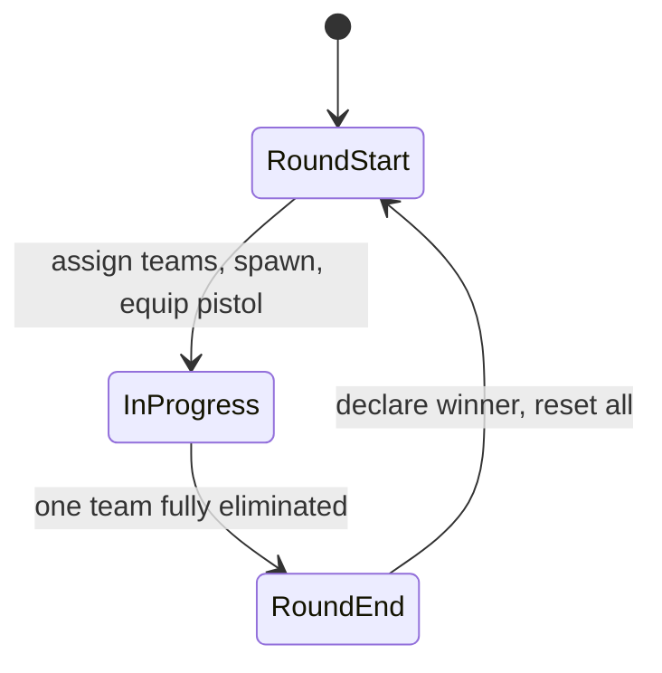

# Conter Strai — Design (current)

## Stack

- **Astro 7** — pages, layout; **Node.js adapter** (`@astrojs/node`, `output: 'server'`) for multiplayer (US-5)
- **Three.js** via **@react-three/fiber** + **drei** — game island on `/play`
- **Zustand** — game session, health, players, round state
- **Tailwind 4** — landing UI + HUD
- **[Colyseus](https://colyseus.io/framework/)** — real-time rooms, Schema sync, matchmaking (US-5)

## Game loop (round-based)



| Phase           | Behavior                                                                        |
| --------------- | ------------------------------------------------------------------------------- |
| **Round start** | Split players into Puma / Lion; teleport to team spawns; full HP; equip pistol  |
| **In progress** | PvP combat; eliminated players spectate or wait (no respawn)                    |
| **Round end**   | One team wiped → opposing team wins; show banner; after brief delay, next round |

## Teams

| Team | ID     | Motif                                        |
| ---- | ------ | -------------------------------------------- |
| Puma | `puma` | Argentina — puma (national / regional fauna) |
| Lion | `lion` | England — heraldic lion                      |

Team IDs are `puma` \| `lion` everywhere in code. Display names: **Puma** / **Lion**.

Team assignment: random or balanced split in MVP; **server assigns teams** in Colyseus `MatchRoom` (US-5).

## Weapons (loadout)

| Weapon | MVP                       | Future            |
| ------ | ------------------------- | ----------------- |
| Pistol | Yes — default round start | —                 |
| Knife  | No                        | Melee, silent     |
| Rifle  | No                        | Primary weapon    |
| Others | No                        | SMG, sniper, etc. |

Weapon registry mirrors soldier/scenario pattern (`src/modules/weapons/` — future).

## Module map

```
src/
├── pages/index.astro     Landing (hero, CTA, GitHub footer) — Astro-only
├── components/           Shared Astro UI (GithubIcon, …)
├── modules/              (US-2+)
│   ├── game/             Session shell, GameCanvas, FPS controls, HUD, round state
│   ├── scenario/         Config-driven maps (arena-01); team spawn points
│   ├── soldier/          Soldier registry, model, hitboxes
│   ├── combat/           HP, zone damage, difficulty, elimination
│   ├── weapons/          Loadout, pistol (MVP); knife/rifle later
│   └── multiplayer/      Colyseus adapter + MatchRoom / Schema (US-5)
├── layouts/              Base shell (SEO, fonts, atmosphere)
└── styles/               Design tokens + landing/HUD utilities
```

## Landing (`/`)

| Piece  | Detail                                                                                                                             |
| ------ | ---------------------------------------------------------------------------------------------------------------------------------- |
| Files  | `src/pages/index.astro`, `src/layouts/base-layout.astro`, `src/components/GithubIcon.astro`, `src/styles/global.css`               |
| Layout | Full-viewport: status strip → hero (copy + CTA left, `soldiers.png` right) → footer; stack on mobile                               |
| Theme  | Near-black surfaces; CS amber accent (`--accent`); `.game-atmosphere` vignette/glow; Barlow Condensed + Rajdhani + Share Tech Mono |
| CTA    | **Start Game** → `/play` (high-contrast accent clip-path button)                                                                   |
| Footer | **Contribute on GitHub** → repo from `package.json` `homepage` (opens in new tab; `GithubIcon`)                                    |
| SEO    | Title, description, OG/Twitter image (`/soldiers.png`), dark `theme-color`, favicon `/conter-strai.png`                            |
| Bundle | Astro-only — no Three.js / R3F on this route                                                                                       |

## Routes

| Route   | Owner                                                 |
| ------- | ----------------------------------------------------- |
| `/`     | Astro landing — no Three.js                           |
| `/play` | Astro shell + R3F `GameCanvas` island (`client:load`) |

## Data flow (combat)

```
useShooting (raycast) → hit zone from mesh userData
  → applyDamage (service) → health store → HUD
  → isEliminated → disable controls (no respawn this round)
  → round service checks team wipe → round end → respawn all
```

## Multiplayer (US-5)

- Astro **Node adapter** serves the app; **Colyseus** rooms sync state over WebSocket.
- Schema per player: `{ x, y, z, rotY, hp, eliminated, team }`.
- Shots and round wipe are **server-authoritative** (room messages + Schema mutations).
- Client uses `colyseus-adapter` only — game modules do not import Colyseus directly.
