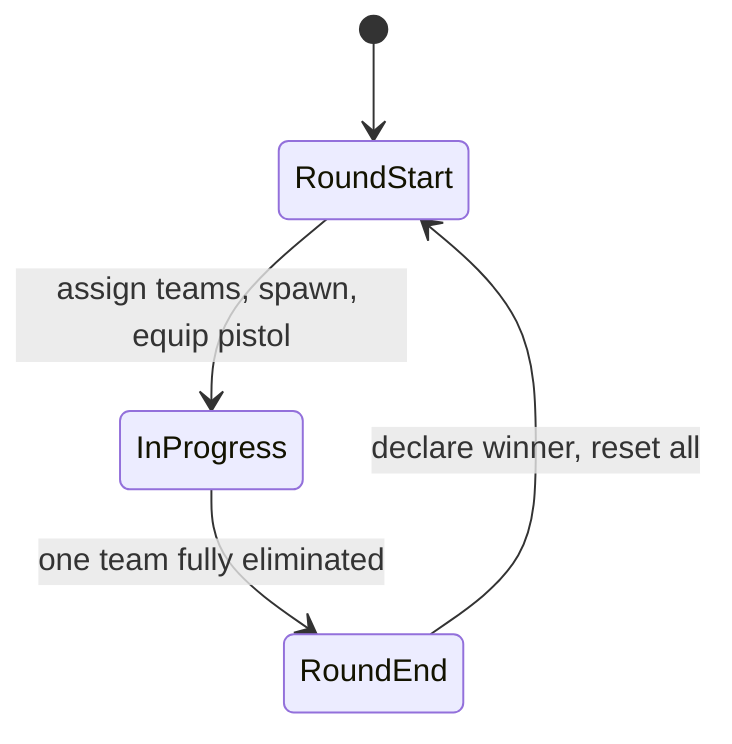

# Conter Strai — Design (current)

## Stack

- **Astro 7** — pages, layout; **Node.js adapter** (`@astrojs/node`, `output: 'server'`) for multiplayer (US-5)
- **Three.js** via **@react-three/fiber** + **drei** — game island on `/play`
- **Zustand** — game session, health, players, round state
- **Tailwind 4** — landing UI + HUD
- **[Colyseus](https://colyseus.io/framework/)** — real-time rooms, Schema sync, matchmaking (US-5)

## Game loop (round-based)



| Phase           | Behavior                                                                        |
| --------------- | ------------------------------------------------------------------------------- |
| **Round start** | Split players into Puma / Lion; teleport to team spawns; full HP; equip pistol  |
| **In progress** | PvP combat; eliminated players spectate or wait (no respawn)                    |
| **Round end**   | One team wiped → opposing team wins; show banner; after brief delay, next round |

## Teams

| Team | ID     | Motif                                        |
| ---- | ------ | -------------------------------------------- |
| Puma | `puma` | Argentina — puma (national / regional fauna) |
| Lion | `lion` | England — heraldic lion                      |

Team IDs are `puma` \| `lion` everywhere in code. Display names: **Puma** / **Lion**.

Team assignment: random or balanced split in MVP; **server assigns teams** in Colyseus `MatchRoom` (US-5).

## Weapons (loadout)

| Weapon | MVP                       | Future            |
| ------ | ------------------------- | ----------------- |
| Pistol | Yes — default round start | —                 |
| Knife  | No                        | Melee, silent     |
| Rifle  | No                        | Primary weapon    |
| Others | No                        | SMG, sniper, etc. |

Weapon registry mirrors soldier/scenario pattern (`src/modules/weapons/` — future).

## Module map

```
src/
├── pages/index.astro     Landing (hero, CTA, GitHub footer) — Astro-only
├── components/           Shared Astro UI (GithubIcon, …)
├── modules/
│   ├── game/             Session shell, GameCanvas, FPS controls, HUD, round state
│   ├── scenarios/        Config-driven maps (arena-01); team spawn points
│   ├── soldiers/         Skin registry, model, locomotion
│   ├── combat/           Hitboxes, HP, zone damage, difficulty
│   ├── weapons/          Loadout, pistol (MVP); knife/rifle later
│   └── multiplayer/      Colyseus adapter + MatchRoom / Schema (US-5)
├── layouts/              Base shell (SEO, fonts, atmosphere)
└── styles/               Design tokens + landing/HUD utilities
```

## Module types

One `types.ts` per module (same as `textures/`, `teams/`, `props/`). Registries at module root; no `types/` subfolders until a file exceeds ~200 lines.

```
src/modules/
├── scenarios/types.ts          ScenarioConfig (flat composition), ArenaLayout, spawns
├── soldiers/types.ts           SoldierSkin, controller, entity (hitboxPresetId only)
├── soldiers/soldier-skin-registry.ts
├── combat/types.ts             HitZone, HitboxPreset, DamageData, HealthSystem
├── combat/hitbox-preset-registry.ts
├── combat/apply-damage.ts
├── weapons/types.ts            PistolWeaponConfig, BulletHitResult, Loadout
└── game/types.ts               GameMode, RoundPhase
```

| Domain       | Key types                                                          | Notes                                                         |
| ------------ | ------------------------------------------------------------------ | ------------------------------------------------------------- |
| **Scenario** | `ScenarioConfig`, `ArenaLayout`, `SpawnerConfig`                   | Flat access (`scenario.bounds`); maps under `scenarios/maps/` |
| **Soldier**  | `SoldierSkin`, `CharacterMeshData`, `Soldier`, `SoldierController` | Visual preset decoupled from hitbox via `hitboxPresetId`      |
| **Combat**   | `HitboxPreset`, `HitZone`, `DamageData`, `HealthSystem`            | Owns collider presets and raycast zones                       |
| **Weapons**  | `PistolWeaponConfig` / `WeaponConfig`, `Loadout`               | Per-weapon `damageByZone`; combat applies × difficulty        |
| **Game**     | `GameMode`, `RoundPhase`                                           | `'team-elimination'`; `'live' \| 'round-end'`                 |

Shipped 2026-08-23 — see [CHANGELOG](../CHANGELOG.md#shipped--other).

## Landing (`/`)

| Piece  | Detail                                                                                                                             |
| ------ | ---------------------------------------------------------------------------------------------------------------------------------- |
| Files  | `src/pages/index.astro`, `src/layouts/base-layout.astro`, `src/components/GithubIcon.astro`, `src/styles/global.css`               |
| Layout | Full-viewport: status strip → hero (copy + CTA left, `soldiers.png` right) → footer; stack on mobile                               |
| Theme  | Near-black surfaces; CS amber accent (`--accent`); `.game-atmosphere` vignette/glow; Barlow Condensed + Rajdhani + Share Tech Mono |
| CTA    | **Start Game** → `/play` (high-contrast accent clip-path button)                                                                   |
| Footer | **Contribute on GitHub** → repo from `package.json` `homepage` (opens in new tab; `GithubIcon`)                                    |
| SEO    | Title, description, OG/Twitter image (`/soldiers.png`), dark `theme-color`, favicon `/conter-strai.png`                            |
| Bundle | Astro-only — no Three.js / R3F on this route                                                                                       |

## Routes

| Route   | Owner                                                 |
| ------- | ----------------------------------------------------- |
| `/`     | Astro landing — no Three.js                           |
| `/play` | Astro shell + R3F `GameCanvas` island (`client:load`) |

## Play island (`/play`) — shipped US-2

Units: **1 world unit = 1 meter**.

### Registries

| Registry         | Role                                                        | Example ids                         |
| ---------------- | ----------------------------------------------------------- | ----------------------------------- |
| **Texture**      | Floor/wall GLB materials under `/assets/textures/`          | `forrest_ground`, `coral_fort_wall` |
| **Prop**         | Placeable objects (trees, barrels, cover)                   | deferred (`props: []` on arena-01)  |
| **Scenario**     | Map layout: bounds, materials, props, team spawns           | `arena-01`                          |
| **Soldier skin** | Visual presets (`SoldierSkin`); hitbox via `hitboxPresetId` | `swat-guy`                          |

`ScenarioScene` reads config only — new arena / prop = registry + placements, not a new React scene.

### Key components

- `GameCanvas` — R3F Canvas, lights, camera
- `ScenarioScene` — floor + outer walls + `wallSegments` + generic `props`
- `SoldierModel` — NPC spawns; `LocalPlayer` — one clone + mixer
- `useFpsControls` — WASD, mouse, locomotion intent, collision
- `useSoldierLocomotion` — idle / walk / run + jump / kneel
- `CameraHud` / `CrosshairHud` — mode label + screen crosshair; world aim marker on look-ray hit

### Camera modes (**C**)

| Mode                  | Role                                                                                         |
| --------------------- | -------------------------------------------------------------------------------------------- |
| **First-person**      | Camera on head bone; head mesh hidden; spine pitch follows look; same clone (no view-model)  |
| **Over-the-shoulder** | Close behind right shoulder (~1.75 m back, ~1.55 m up)                                       |
| **Third-person**      | Farther behind/above (~3.6 m back, ~2.4 m up)                                                |

Shared hot-path state: `origin`, `yaw`, `pitch`, `mode` (`game/state/player-state.ts`). OTS/TPS boom height rides head-bone world Y after mixer update.

### Locomotion / actions

| Input        | Clip    | Notes                                       |
| ------------ | ------- | ------------------------------------------- |
| Stand still  | `idle`  | Default                                     |
| WASD         | `walk`  | In-place; hips translation stripped         |
| WASD + Space | `run`   | Faster move + run clip                      |
| **F**        | `jump`  | One-shot; animation-only (no Y physics)     |
| **E**        | `kneel` | Toggle; `LoopOnce` + clamp; cancel on WASD  |

Priority: blocking one-shots (US-4 `reloading` / `shooting`, jump) → kneel → locomotion. `dying` clip is in the GLB; wire on elimination in **US-3**.

### Interior collision

Axis-aligned segments from house footprints; doorway holes via `WALL_HOLE_WIDTH`. Player circle (`PLAYER_RADIUS`) vs segments after intended move; outer bounds clamp last.

### arena-01 — Ruined Village

| Field        | Value                                                                      |
| ------------ | -------------------------------------------------------------------------- |
| **bounds**   | 100 m × 50 m; wall height 3.5 m                                            |
| **floor**    | `forrest_ground`                                                           |
| **walls**    | `coral_fort_wall` perimeter + interior ruin segments                       |
| **spawns**   | Puma west (−X), Lion east (+X); face map center                            |
| **props**    | `[]` — slots ready for trees / cover later                                 |

### Testing

| Layer          | Scope                                                                                          |
| -------------- | ---------------------------------------------------------------------------------------------- |
| **Vitest**     | Registries; clip resolve / hips strip; GLB JSON contract; locomotion state; collision; FPS hide |
| **Playwright** | `/play` canvas, no `PropertyBinding` errors; crosshair; optional `__PLAY_TEST__` hook          |

## Data flow (combat)

```
useShooting (raycast) → hit zone from mesh userData
  → applyDamage (service) → health store → HUD
  → isEliminated → disable controls (no respawn this round)
  → round service checks team wipe → round end → respawn all
```

## Multiplayer (US-5)

- Astro **Node adapter** serves the app; **Colyseus** rooms sync state over WebSocket.
- Schema per player: `{ x, y, z, rotY, hp, eliminated, team }`.
- Shots and round wipe are **server-authoritative** (room messages + Schema mutations).
- Client uses `colyseus-adapter` only — game modules do not import Colyseus directly.
