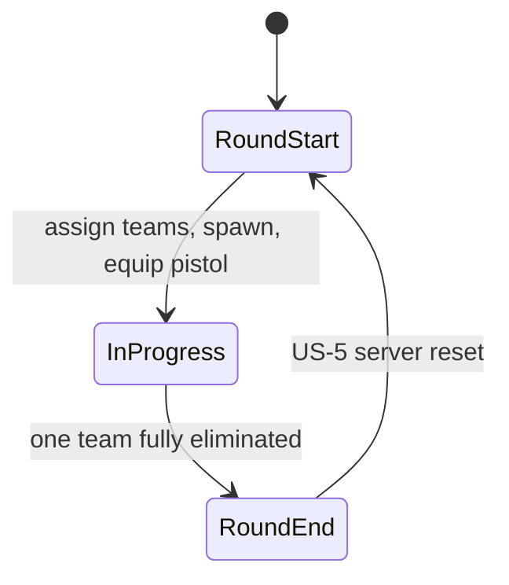

# Conter Strai — Design (current)

## Stack

- **Astro 7** — pages, layout; **Node.js adapter** (`@astrojs/node`, `output: 'server'`) for multiplayer (US-5)
- **Three.js** via **@react-three/fiber** + **drei** — game island on `/room/{id}/play`
- **Zustand** — game session, health, players, round state
- **Tailwind 4** — landing UI + HUD
- **[Colyseus](https://colyseus.io/framework/)** — real-time rooms, Schema sync, matchmaking (US-5)

## Game loop (round-based)



| Phase           | Behavior                                                                                |
| --------------- | --------------------------------------------------------------------------------------- |
| **Round start** | Split players into Civilians / Soldiers; teleport to team spawns; full HP; equip pistol |
| **In progress** | PvP combat; eliminated players spectate or wait (no respawn)                            |
| **Round end**   | One team wiped → opposing team wins; show banner. Next-round reset is US-5              |

## Teams

| Team      | ID         | Motif                                                                            |
| --------- | ---------- | -------------------------------------------------------------------------------- |
| Civilians | `civilian` | Irregular / non-military side — default play skin `remy` (also `james` / `liza`) |
| Soldiers  | `soldier`  | Military side — `swat-1` / `swat-2` / `swat-3`                                   |

Team IDs are `civilian` \| `soldier` everywhere in code. Display names: **Civilians** / **Soldiers** (`TEAM_DISPLAY_NAME`).

Team assignment: random or balanced split in MVP; **server assigns teams** in Colyseus `MatchRoom` (US-5).

## Weapons (loadout)

| Weapon | MVP                       | Future            |
| ------ | ------------------------- | ----------------- |
| Pistol | Yes — default round start | —                 |
| Knife  | No                        | Melee, silent     |
| Rifle  | No                        | Primary weapon    |
| Others | No                        | SMG, sniper, etc. |

Weapon registry lives in `src/modules/weapons/` (`weapon-registry.ts`, `PistolWeaponConfig`). Pistol mesh attaches at runtime to the Mixamo right-hand bone (`WeaponAttach`); do not bake weapons into character mesh GLBs.

## Module map

```
src/
├── pages/index.astro     Landing (hero, CTA, GitHub footer) — Astro-only
├── pages/room/           Create / join / wait / play (US-7)
├── components/           Shared Astro UI (GithubIcon, …)
├── modules/
│   ├── lobby/            Room session, create/join/wait islands, invite share + QR
│   ├── game/             Session shell, GameCanvas, FPS controls, HUD, round state
│   ├── scenarios/        Config-driven maps (arena-01); team spawn points
│   ├── soldiers/         Skin registry, model, locomotion
│   ├── combat/           Hitboxes, HP, zone damage, difficulty
│   ├── weapons/          Loadout, pistol (MVP); knife/rifle later
│   └── multiplayer/      Colyseus adapter + MatchRoom / Schema (US-5)
├── layouts/              Base shell (SEO, fonts, atmosphere)
└── styles/               Design tokens + landing/HUD utilities
```

## Module types

One `types.ts` per module (same as `textures/`, `teams/`, `props/`). Registries at module root; no `types/` subfolders until a file exceeds ~200 lines.

```
src/modules/
├── scenarios/types.ts          ScenarioConfig (flat composition), ArenaLayout, spawns
├── soldiers/types.ts           SoldierSkin, controller, entity (hitboxPresetId only)
├── soldiers/soldier-skin-registry.ts
├── combat/types.ts             HitZone, HitboxPreset, DamageData, HealthSystem
├── combat/hitbox-preset-registry.ts
├── combat/apply-damage.ts
├── weapons/types.ts            PistolWeaponConfig, BulletHitResult, Loadout
└── game/types.ts               GameMode, RoundPhase
```

| Domain       | Key types                                                          | Notes                                                         |
| ------------ | ------------------------------------------------------------------ | ------------------------------------------------------------- |
| **Scenario** | `ScenarioConfig`, `ArenaLayout`, `SpawnerConfig`                   | Flat access (`scenario.bounds`); maps under `scenarios/maps/` |
| **Soldier**  | `SoldierSkin`, `CharacterMeshData`, `Soldier`, `SoldierController` | Visual preset decoupled from hitbox via `hitboxPresetId`      |
| **Combat**   | `HitboxPreset`, `HitZone`, `DamageData`, `HealthSystem`            | Owns collider presets and raycast zones                       |
| **Weapons**  | `PistolWeaponConfig` / `WeaponConfig`, `Loadout`                   | Per-weapon `damageByZone`; combat applies × difficulty        |
| **Game**     | `GameMode`, `RoundPhase`                                           | `'team-elimination'`; `'live' \| 'round-end'`                 |

Shipped 2026-08-23 — see [CHANGELOG](../CHANGELOG.md#shipped--other).

## Landing (`/`)

| Piece  | Detail                                                                                                                             |
| ------ | ---------------------------------------------------------------------------------------------------------------------------------- |
| Files  | `src/pages/index.astro`, `src/layouts/base-layout.astro`, `src/components/GithubIcon.astro`, `src/styles/global.css`               |
| Layout | Full-viewport: status strip → hero (copy + CTA left, `cs.png` right) → footer; stack on mobile                                     |
| Theme  | Near-black surfaces; CS amber accent (`--accent`); `.game-atmosphere` vignette/glow; Barlow Condensed + Rajdhani + Share Tech Mono |
| CTA    | **Create Room** → `/room`; **Join Room** → `/room/join`                                                                            |
| Footer | **Contribute on GitHub** → repo from `package.json` `homepage` (opens in new tab; `GithubIcon`)                                    |
| SEO    | Title, description, OG/Twitter image (`/cs.png`), dark `theme-color`, favicon `/conter-strai.png`                                  |
| Bundle | Astro-only — no Three.js / R3F on this route                                                                                       |

## Routes

| Route                 | Owner                                                                 |
| --------------------- | --------------------------------------------------------------------- |
| `/`                   | Astro landing — no Three.js                                           |
| `/room`               | Create room (team / skin / arena + R3F preview)                       |
| `/room/join`          | Join by typed room id + team / skin                                   |
| `/room/[roomId]`      | Waiting room (invite URL, copy, QR, Play)                             |
| `/room/[roomId]/join` | Invite join (room id from path)                                       |
| `/room/[roomId]/play` | Game canvas — boot from `sessionStorage`                              |

## Match lobby — shipped US-7

Local-first pre-play lobby (`src/modules/lobby/`). No Colyseus yet — US-5 wires these routes to rooms.

```
sessionStorage[`cs:room:${roomId}`] = {
  team: Team;
  skin: SoldierSkinId;
  scenario: ScenarioId;   // create: chosen; join: arena-01 until host sync (US-5)
  role: 'host' | 'guest';
}
```

| Skin ↔ team | Defaults |
| ----------- | -------- |
| civilian → `remy` / `james` / `liza` | `remy` |
| soldier → `swat-1` / `swat-2` / `swat-3` | `swat-1` |

Missing/invalid play session → `civilian` + `remy` + `arena-01` with team↔skin consistency. Invite URL is path-only: `{origin}/room/{roomId}/join`. `ScenarioConfig.previewImageUrl` optional (`arena-01` null until art). Civilian east spawn required for civilian pick.

## Play island (`/room/.../play`) — shipped US-2 + US-7 boot

Units: **1 world unit = 1 meter**.

### Registries

| Registry         | Role                                                                                | Example ids                                                     |
| ---------------- | ----------------------------------------------------------------------------------- | --------------------------------------------------------------- |
| **Texture**      | Floor/wall GLB materials under `/assets/textures/`                                  | `forrest_ground`, `coral_fort_wall`                             |
| **Prop**         | Placeable objects (trees, barrels, cover)                                           | deferred (`props: []` on arena-01)                              |
| **Scenario**     | Map layout: bounds, materials, props, team spawns                                   | `arena-01`                                                      |
| **Soldier skin** | Visual presets (`SoldierSkin`); hitbox via `hitboxPresetId`; clips from shared pack | `remy` (default), `james`, `liza`, `swat-1`, `swat-2`, `swat-3` |

`ScenarioScene` reads config only — new arena / prop = registry + placements, not a new React scene.

### Key components

- `GameCanvas` — R3F Canvas, lights, camera
- `ScenarioScene` — floor + outer walls + `wallSegments` + generic `props`
- `SoldierModel` — NPC spawns; `LocalPlayer` — one clone + mixer
- `useFpsControls` — WASD, mouse, locomotion intent, collision
- `useShooting` — camera-center pistol hitscan, cooldown, no friendly fire
- `useSoldierLocomotion` — idle / walk / run / crouch-walk + jump / kneel / reload / dying
- `CameraHud` / `CrosshairHud` — mode label + screen crosshair; world aim marker on look-ray hit

### Camera modes (**C**)

Default on play boot: **over-the-shoulder**. Cycle with **C**: FPS → OTS → TPS → …

| Mode                  | Role                                                                                                   |
| --------------------- | ------------------------------------------------------------------------------------------------------ |
| **First-person**      | Camera on head bone; head mesh hidden; spine pitch follows look; same clone (no view-model)            |
| **Over-the-shoulder** | Close behind right shoulder (~1.75 m back, ~1.55 m up) — **default**                                   |
| **Third-person**      | Farther behind/above (~3.6 m back, ~2.4 m up)                                                          |
| **Free (dev)**        | **V** toggles; ghost fly (WASD + click-to-look, Q/E up/down, Shift boost); no collision; player frozen |

Shared hot-path state: `origin`, `yaw`, `pitch`, `mode` (`game/state/player-state.ts`). OTS/TPS boom height rides head-bone world Y after mixer update. Free-cam + Playwright probe live under `game/dev/` and are **lazy-loaded only when `import.meta.env.DEV`** (absent from production bundles). Production pauses for any R3F `controls` owner — no free-cam import.

### Locomotion / actions

| Input              | Clip             | Notes                                                         |
| ------------------ | ---------------- | ------------------------------------------------------------- |
| Stand still        | `idle`           | Default                                                       |
| WASD               | `walk`           | In-place; hips translation stripped                           |
| WASD + Space       | `run`            | Faster move + run clip                                        |
| **E**              | `kneel`          | Toggle; `LoopOnce` + clamp; WASD does **not** clear kneel     |
| Kneel + WASD       | `crouch-walking` | Loop; walk-speed; kneel pose kept                             |
| Kneel + WASD+Space | `run`            | Run speed + stand run clip; kneel pose kept → resumes on stop |
| **F**              | `jump`           | One-shot; animation-only (no Y physics); clears kneel first   |
| **R**              | `reloading`      | One-shot; stand+idle or `reloading-kneel`; WASD cancels       |
| **LMB**            | —                | Hitscan pistol (no `shooting` pose until a shippable clip)    |

Priority: blocking one-shots (`reloading` / `reloading-kneel` > `jump`) → kneel + run → run → kneel + walk → crouch-walk → kneel + idle → locomotion → **`dying`** on elimination. Optional `shooting` is mixer-ready but not triggered.

### Interior collision

Axis-aligned segments from house footprints; doorway holes via `WALL_HOLE_WIDTH`. Player circle (`PLAYER_RADIUS`) vs segments after intended move; outer bounds clamp last.

### arena-01 — Ruined Village

| Field      | Value                                                    |
| ---------- | -------------------------------------------------------- |
| **bounds** | 100 m × 50 m; wall height 3.5 m                          |
| **floor**  | `forrest_ground`                                         |
| **walls**  | `coral_fort_wall` perimeter + interior ruin segments     |
| **spawns** | Soldiers west (−X), Civilians east (+X); face map center |
| **props**  | `[]` — slots ready for trees / cover later               |

### Testing

| Layer          | Scope                                                                                                                            |
| -------------- | -------------------------------------------------------------------------------------------------------------------------------- |
| **Vitest**     | Registries; shared-pack + mesh Armature contract; clip resolve / hips strip; kneel→crouch-walk; locomotion; collision; FPS hide  |
| **Playwright** | Room play (`remy` / `swat-1`); no `PropertyBinding` errors; kneel + WASD stays crouched; optional `__PLAY_TEST__` hook |

## Characters — shipped US-6

Locomotion and action clips load from `/assets/characters/shared/base-animations.glb`. Mesh GLBs are skins only.

| Skin ids                     | Team     | Mesh path                               |
| ---------------------------- | -------- | --------------------------------------- |
| `remy`, `james`, `liza`      | civilian | `/assets/characters/civilians/<id>.glb` |
| `swat-1`, `swat-2`, `swat-3` | soldier  | `/assets/characters/soldiers/<id>.glb`  |

Default play skin from session is `remy` (civilian, east spawn) when unset; non-default skins come from room session on `/room/{roomId}/play`.

**Skeleton contract:** Mixamo `Armature` with bone names `mixamorig:*` (colon form). Vendor exports with numbered prefixes (`mixamorig9:`, …) are rewritten in-asset (`npm run assets:normalize-characters`) so shared-pack tracks and aim/FPS lookups bind.

**Required shared clips:** `idle`, `walk`, `run`, `jump`, `kneel`, `crouch-walking`, `dying`, `reloading`, `reloading-kneel`. Optional: `shooting` (deferred — not played on LMB), `hit-reaction`.

**Clip resolve:** `useGLTF` mesh + shared pack; merge lists (**shared wins** on name); resolve by registry names (null if a required clip is missing); strip hips translation on `idle` / `walk` / `run` / `crouch-walking`.

**Removed:** `/assets/soldiers/swat-soldier.glb` and skin id `swat-guy`.

## Combat — shipped US-3

### Damage

```
damage = maxHp × weapon.damageByZone[zone] × DIFFICULTY_MULT[difficulty]
nextHp = max(0, currentHp − damage)
```

| Weapon   | head | body | limb | Status                         |
| -------- | ---- | ---- | ---- | ------------------------------ |
| `pistol` | 0.40 | 0.20 | 0.15 | MVP — only equipped weapon now |
| `knife`  | TBD  | TBD  | TBD  | Future loadout                 |

- **Weapons own** per-zone fractions on `weapon-registry.ts`; **combat** owns pure `applyDamage` + `DIFFICULTY_MULT` — no Three.js in the service.
- **Health store** (`health-store.ts`, Zustand): per-`EntityId` HP map; resolves `weaponId` → profile; sets `isEliminated` via `isEliminated(hp)`.
- HP resets on round end only (`resetAll` in the round service).

### Hitboxes

Invisible meshes from `HitboxPreset.parts` (`humanoid-standard`); each part tagged `userData.hitZone` + `userData.entityId`. Skins reference preset via `hitboxPresetId` only — no geometry on skin config.

Attached on `LocalPlayer` and `SoldierModel` when `entityId` is set.

### HUD + elimination

- `HealthBar` — DOM overlay, local player HP %.
- At 0 HP: `isEliminated: true`; FPS controls disabled; **`dying`** one-shot on mixer (`LocalPlayer` / `SoldierModel` via `getPose`).
- No mid-round respawn; round reset restores HP.

### Key files

| File                                | Role                                 |
| ----------------------------------- | ------------------------------------ |
| `combat/apply-damage.ts`            | Pure zone × weapon × difficulty math |
| `combat/health-store.ts`            | Zustand `HealthSystem`               |
| `combat/components/hitbox-mesh.tsx` | Invisible zone colliders             |
| `combat/components/health-bar.tsx`  | HUD                                  |
| `weapons/weapon-registry.ts`        | Pistol `damageByZone`                |

## Data flow (combat)

```
useShooting (raycast) → hit zone from mesh userData
  → health store applyDamage → HUD
  → isEliminated → disable controls + dying clip
  → round service checks team wipe → round end → resetAll
```

## PvP loop — shipped US-4

Local team-elimination on `/room/.../play`. Colyseus authority stays US-5.

### Round service (`game/state/round-store.ts`)

```
startRound() → roster from ScenarioConfig.teamSpawns, resetAll HP, teleport local player, equip pistol
checkRoundEnd() → if all civilians eliminated OR all soldiers eliminated → endRound(winner)
endRound(winner) → RoundPhase 'round-end', winner banner (no local auto-restart; US-5 owns the next round)
```

Local player occupies the session skin/team (default civilian `remy`); remaining spawns are `ScenarioSoldiers` NPCs (opposing-team dummies until US-5).

When `HealthState.isEliminated`, FPS move/look/shoot is disabled and pointer lock is released until the next `startRound()`.

### Shooting

- Pointer-locked **LMB** → `useShooting` raycast from camera center; range 100 m; cooldown `fireCooldownSeconds` (pistol 0.35 s).
- Hits need `userData.hitZone` + `userData.entityId`; friendly fire skipped via round roster.
- `resolveHitDamage` builds `DamageData` with equipped `weaponId` → health store `applyDamage`.
- Gunshot SFX at the camera; injury SFX is spatial on the victim.
- **`shooting` pose is not played** — mixer can resolve an optional clip, but LMB does not set the pose until a shippable fire animation is approved.

### Reload + weapon mesh

- **R** (idle) → `reloading`; **R** while kneeling → `reloading-kneel`. Busy until mixer `finished`; WASD cancels.
- `pistol_a.glb` from registry `modelUrl`; `WeaponAttach` parents a clone under `mixamorig:RightHand` with grip offset on the weapon config.

### Vitest

`resolveHitDamage` (self / friendly / zone) and `checkRoundEnd` (team wipe → winner).

## Multiplayer (US-5)

- Astro **Node adapter** serves the app; **Colyseus** rooms sync state over WebSocket.
- Schema per player: `{ x, y, z, rotY, hp, eliminated, team }`.
- Shots and round wipe are **server-authoritative** (room messages + Schema mutations).
- Client uses `colyseus-adapter` only — game modules do not import Colyseus directly.
