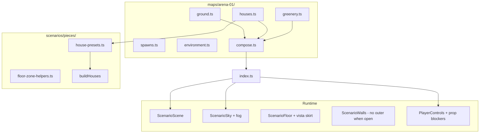

# US-11 — Design

## Problem

`arena-01` (**Ruined Village**) is authored as a single `layout.ts` with overlapping street floor zones (z-fighting), uniform house footprints, empty `props[]`, cliff perimeter walls, and hemisphere-only “sky”. Greenery GLBs exist under `public/assets/greenery/` but are not wired. `collidable` on props is typed but not connected to movement.

## Principles

- **Config-driven** — map authors edit TypeScript data; `ScenarioScene` stays generic ([`specs/current/design.md`](../current/design.md) § Play island).
- **Playable vs vista** — movement clamp stays **100×50 m**; vista skirt and fog are visual-only outside bounds.
- **Validate in CI** — floor overlap and prop blockers get unit tests.

## Architecture



## Type extensions

### [`src/modules/scenarios/types.ts`](../../src/modules/scenarios/types.ts)

```
// ArenaLayout
perimeter?: {
  mode: 'walls' | 'open';
  vistaExtension?: number; // meters beyond bounds each side, e.g. 30
};

// ArenaEnvironment
interface ScenarioSky {
  type: 'gradient' | 'color';
  sunPosition?: Vec3;
  horizonColor?: string;
}

interface ScenarioFog {
  color: string;
  near: number;
  far: number;
}

interface ArenaEnvironment {
  lighting?: ScenarioLighting;
  sky?: ScenarioSky;
  fog?: ScenarioFog;
}
```

### [`src/modules/props/types.ts`](../../src/modules/props/types.ts)

```ts
interface PropDefinition {
  // existing fields…
  collisionRadius?: number; // trunk disc for trees, meters
}
```

### [`HouseFootprint`](../../src/modules/scenarios/pieces/house-helpers.ts)

| Field           | Add                                                                            |
| --------------- | ------------------------------------------------------------------------------ |
| Per-side height | `walls.north.height?: keyof WALL_HEIGHT` or house-level default                |
| Open side       | `'open'` — skip wall segment + collision for that edge                         |
| Floor           | optional `floorAssetId` override; inset interior floor from walls (~0.4–0.5 m) |

Presets in [`house-presets.ts`](../../src/modules/scenarios/pieces/house-presets.ts): `ruinedCottage`, `cornerRuin`, `fortifiedBlock`, `streetShack`, etc.

## Floor overlap

[`ScenarioFloor`](../../src/modules/scenarios/components/scenario-floor.tsx) renders base at Y **-0.02** and zones at **+0.02**. Zone-on-zone overlap at the same Y causes shimmer.

[`floor-zone-helpers.ts`](../../src/modules/scenarios/pieces/floor-zone-helpers.ts):

- `floorZoneBounds`, `zonesOverlap`, `findFloorOverlaps`, `assertNoFloorOverlaps`
- Streets in `ground.ts` split at junctions (vertical strips stop at main street edge, not through it)
- House floors inset so tiles do not bleed into asphalt

## Greenery

| Prop        | Registry                                             | Placement                             | Collision                                    |
| ----------- | ---------------------------------------------------- | ------------------------------------- | -------------------------------------------- |
| `jacaranda` | `/assets/greenery/jacaranda.glb`, `scale` ~0.35–0.45 | Cover at block corners, inside bounds | `collidable: true`, `collisionRadius` ~0.9 m |

Source GLB is a stacked LOD pack (~327 MB / ~6M verts with LOD0+LOD1+trunk/leaf extras all in one scene). Ship **only** `jacaranda_tree_LOD1`, then weld + simplify + 1K WebP textures.

[`prop-blockers-from-scenario.ts`](../../src/modules/game/utils/prop-blockers-from-scenario.ts) → merged in [`use-player-controls.ts`](../../src/modules/game/hooks/use-player-controls/use-player-controls.ts) with `npcBlockersFromScenario`.

## Sky and fog

[`scenario-sky.tsx`](../../src/modules/scenarios/components/scenario-sky.tsx):

- `drei` `<Sky>` when `sky.type === 'gradient'`, synced to `lighting.sunPosition`
- R3F `<fog attach="fog" … />` from `environment.fog`
- Mounted in [`game-canvas.tsx`](../../src/modules/game/components/game-canvas.tsx) beside `ScenarioLighting`

## Open perimeter

When `perimeter.mode === 'open'`:

- [`ScenarioWalls`](../../src/modules/scenarios/components/scenario-walls.tsx) skips `outerWalls()`; interior `wallSegments` unchanged
- [`ScenarioFloor`](../../src/modules/scenarios/components/scenario-floor.tsx) (or `ScenarioVista`) renders extended `forrest_ground` plane: `bounds + 2 * vistaExtension`
- Skirt greenery: distant non-collidable jacaranda via optional `perimeterVistaProps` helper
- Fog hides skirt edge before ground cutoff

`arena-01`: `perimeter: { mode: 'open', vistaExtension: 30 }`; remove reliance on `cliff_side` for outer box.

## Assets

[`scripts/compress-assets.mjs`](../../scripts/compress-assets.mjs) runs a jacaranda-specific pipeline (keep `jacaranda_tree_LOD1`, weld, `simplify`, WebP 1K). Texture resize alone is insufficient for the source LOD pack.

Run `npm run assets:compress` before shipping.

## Tests

| Layer  | Target                                                                       |
| ------ | ---------------------------------------------------------------------------- |
| Unit   | `floor-zone-overlap.test.ts` — zero overlaps in composed arena-01 floors     |
| Unit   | `collision-hole-math.test.ts` — per-side height, open sides, presets         |
| Unit   | `prop-blockers-from-scenario.test.ts` — collidable props → `CircleBlocker[]` |
| Manual | DEV free-cam: junctions, doorways, perimeter vista, tree collision, FPS      |

## Ship checklist

Fold into [`specs/current/`](../current/):

- Extend **FR-2** (or add **FR-51+**) — props, sky, fog, open perimeter on `arena-01`
- Update [`design.md`](../current/design.md) § arena-01 (layout modules, greenery, sky, perimeter, floor rules)
- CHANGELOG row; delete `specs/us-11/`
