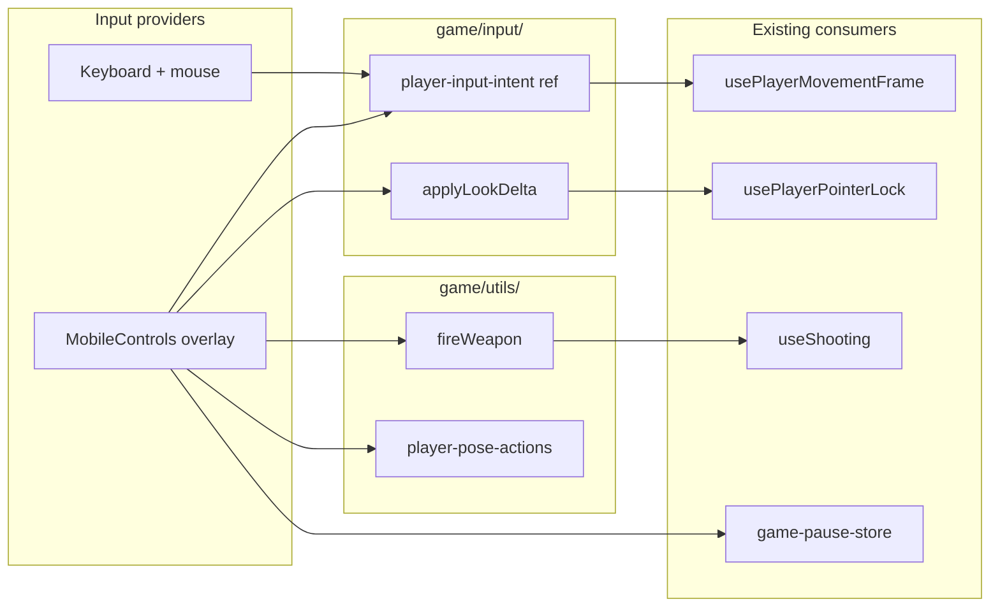

# US-12 — Design

## Problem

Gameplay input is desktop-only: WASD, pointer-lock mouse look, LMB shoot, Esc pause. Mobile is listed **out of scope** in [`specs/current/requirements.md`](../current/requirements.md). Touch-primary users cannot play on `/play`.

## Principles

- **Modular providers** — keyboard/mouse and touch are separate input providers; domain code stays device-agnostic.
- **Reuse domain seams** — `advancePlayerTransform`, `player-pose-actions`, combat raycast; extract shared look/fire helpers rather than duplicating logic.
- **Minimal integration surface** — `GameCanvas` mounts one `<MobileControls />` overlay; movement hook reads merged intent.
- **Desktop unchanged** — overlay gated by `(pointer: coarse)`; pointer lock and keyboard hooks behave as today.

## Architecture



## Module layout

```
src/modules/game/input/
  types.ts                          # PlayerFrameIntent, GameAction
  player-input-intent.ts            # imperative ref (hot path, not Zustand)
  utils/
    apply-look-delta.ts             # shared yaw/pitch delta (from pointer-lock hook)
    is-touch-primary-device.ts      # (pointer: coarse) gate
    joystick-to-axes.ts             # vector → { strafe, forward }
  hooks/
    use-touch-look/                 # right-half drag → applyLookDelta
  components/
    mobile-controls/
      mobile-controls.tsx           # orchestrator; device gate
      virtual-joystick.tsx
      action-button.tsx
      look-zone.tsx
      pause-button.tsx
      index.ts                      # public export only

src/modules/game/utils/
  fire-weapon.ts                    # extracted from use-shooting.ts
```

## Types

```ts
// src/modules/game/input/types.ts
export interface PlayerFrameIntent {
  strafe: -1 | 0 | 1;
  forward: -1 | 0 | 1;
  running: boolean;
}

export type GameAction = 'kneelToggle' | 'sprint' | 'shoot' | 'pause';
```

Intent ref API (imperative, per-frame):

- `getPlayerFrameIntent()` — merged keyboard + touch for movement frame
- `setTouchMoveIntent(strafe, forward)`, `setTouchRunning(running)`, `clearTouchMoveIntent()`
- `isTouchPrimaryDevice()` — `(pointer: coarse)` matchMedia

## UI layout (touch-primary)

```
┌─────────────────────────────────────────┐
│  [☰ Pause]                    [HP ████] │  ← safe-area top
│                                         │
│              (look drag zone)           │
│                                         │
│  [joystick]                  [B] [A]    │
│                                 [fire]  │
└─────────────────────────────────────────┘
```

Face-button icons live in `src/components/icons/` (`IconMenu`, `IconFire`, `IconButtonA`, `IconButtonB`). Pause-panel **Commands** shows the same icons so players can map A → sprint (hold), B → kneel (tap), fire → shoot, menu → pause.

| Zone               | Component               | Action                                   |
| ------------------ | ----------------------- | ---------------------------------------- |
| Top-left           | `PauseButton` (`IconMenu`) | `setPaused(true)` → `GamePausePanel`  |
| Top-right          | `HealthBar` (relocated) | existing combat HUD                      |
| Bottom-left        | `VirtualJoystick`       | move axes                                |
| Bottom-right stack | `ActionButton` × 3      | `IconButtonB` kneel (tap), `IconButtonA` run (hold), `IconFire` fire |
| Right ~50%         | `LookZone`              | touch-drag look                          |

### Pause menu — camera cycle (US-12.11)

On the **main** pause view (alongside Resume / Restart / Leave / Commands):

```
┌──────────────────────────────┐
│           Paused             │
│  [ Resume ]                  │
│  [ Restart ]                 │
│  Camera: Over-the-shoulder   │  ← live label via useCameraMode()
│  [ Cycle camera ]            │  ← cycleCameraMode()
│  [ Commands ]                │
│  [ Leave ]                   │
└──────────────────────────────┘
```

- Reuse `cycleCameraMode()` from [`player-state.ts`](../../src/modules/game/stores/player-state.ts) — same cycle order as **C** (`fps` → `ots` → `tps`).
- Extract `CAMERA_MODE_LABELS` to a shared constant (e.g. `game/constants/camera-mode-labels.ts`) used by `CameraHud` and `GamePausePanel`.
- Add `MOBILE_BINDINGS.cameraCycle` → `"Pause menu → Cycle camera"` for Commands list on touch-primary.
- Camera applies on resume via existing `applyCameraMode` in the movement frame — no R3F hook coupling in the panel.

## Integration points

| File                                                                                                            | Change                                                            |
| --------------------------------------------------------------------------------------------------------------- | ----------------------------------------------------------------- |
| [`use-player-movement-frame.ts`](../../src/modules/game/hooks/use-player-controls/use-player-movement-frame.ts) | Read `PlayerFrameIntent` (keyboard OR touch)                      |
| [`use-player-pointer-lock.ts`](../../src/modules/game/hooks/use-player-controls/use-player-pointer-lock.ts)     | Skip lock on touch-primary; use `applyLookDelta`                  |
| [`use-shooting.ts`](../../src/modules/game/hooks/use-shooting.ts)                                               | Delegate to `fireWeapon()`; no pointer-lock gate on touch-primary |
| [`game-canvas.tsx`](../../src/modules/game/components/game-canvas/game-canvas.tsx)                              | Mount `<MobileControls />`                                        |
| [`health-bar.tsx`](../../src/modules/combat/components/health-bar.tsx)                                          | `top-4 right-4` + safe-area                                       |
| [`camera-hud.tsx`](../../src/modules/game/components/camera-hud.tsx)                                            | Hide when touch-primary; share mode labels with pause panel       |
| [`game-pause-panel.tsx`](../../src/modules/game/components/game-pause-panel/game-pause-panel.tsx)               | Camera label + Cycle camera button (`cycleCameraMode`)            |
| [`game-bindings.ts`](../../src/modules/game/constants/game-bindings.ts)                                         | Add `MOBILE_BINDINGS` (optional Commands labels)                  |

## Coupling rules

- `mobile-controls` imports: `input/*`, `player-pose-actions`, `fire-weapon`, `game-pause-store` — **never** `usePlayerControls` internals or R3F hooks.
- No touch listeners inside `combat/`, `soldiers/`, or pure movement utils.
- `player-state` stays imperative; do not mirror into React state for touch.

## Risks

| Risk                             | Mitigation                                                    |
| -------------------------------- | ------------------------------------------------------------- |
| Fire button drag triggers look   | `stopPropagation` on buttons; look zone excludes button rects |
| Kneel idle-only (desktop parity) | Document in acceptance; no behavior change this US            |
| Notched phones clip HUD          | `env(safe-area-inset-*)` on top bar                           |
