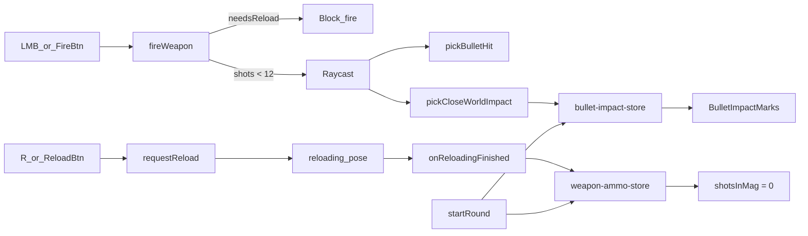

# US-13 — Design

## Problem

Reload animation and **R** binding exist (FR-23) but there is **no magazine limit** — players can fire indefinitely without reloading. Mobile has fire / kneel / sprint but **no reload button** (listed out-of-scope in FR-111). Wall hits occlude shots (`pickBulletHit` returns `null` on world geometry) but leave **no visual feedback** at close range.

## Principles

- **Reuse reload pose pipeline** — `requestReload`, `onReloadingFinished`, `FIRE_BLOCKED_POSES`; do not add a parallel reload state machine.
- **Client-side magazine** — gate `fireWeapon()` before cooldown stamp; server unchanged.
- **Cosmetic impacts only** — local Zustand store + lightweight R3F meshes; no Colyseus messages.
- **Minimal mobile surface** — one tap button + bindings parity with desktop **R**.

## Architecture



## Constants

Add to [`src/modules/weapons/constants/pistol.ts`](../../src/modules/weapons/constants/pistol.ts):

```ts
export const PISTOL_MAGAZINE_SIZE = 12;
export const CLOSE_RANGE_IMPACT_METERS = 2;
```

## Magazine store

New [`src/modules/game/stores/weapon-ammo-store.ts`](../../src/modules/game/stores/weapon-ammo-store.ts) (Zustand, same style as `game-pause-store`):

```ts
interface WeaponAmmoState {
  shotsInMag: number;
  recordShot: () => void;
  needsReload: () => boolean;
  onReloadComplete: () => void;
  reset: () => void;
}
```

- `recordShot()` — increment after a shot is taken (post-gate, when cooldown is stamped)
- `needsReload()` — `shotsInMag >= PISTOL_MAGAZINE_SIZE`
- `onReloadComplete()` — `shotsInMag = 0`
- `reset()` — `shotsInMag = 0` on round start

Wire points:

| Hook / file                                                                           | Change                                                             |
| ------------------------------------------------------------------------------------- | ------------------------------------------------------------------ |
| [`fire-weapon.ts`](../../src/modules/game/utils/fire-weapon.ts)                       | Early-return when `needsReload()`; call `recordShot()` after stamp |
| [`local-player.tsx`](../../src/modules/game/components/local-player/local-player.tsx) | `clearReloadingPose()` → `onReloadComplete()`                      |
| [`round-store.ts`](../../src/modules/game/stores/round-store.ts) `startRound`         | `reset()` ammo + impact stores                                     |

Export `resetWeaponAmmo()` from `fire-weapon.ts` (or store) for unit tests alongside `resetFireWeaponCooldown()`.

## Close-range impact marks

### Ray helper

New [`src/modules/game/utils/pick-close-world-impact.ts`](../../src/modules/game/utils/pick-close-world-impact.ts):

- Walk `raycaster.intersectObject(scene, true)` like `pickAimSurface` / `pickBulletHit`
- Skip local player root, aim marker
- First **visible, untagged** mesh with `distance <= CLOSE_RANGE_IMPACT_METERS`
- Return `{ point: [x,y,z], normal: [x,y,z] }` — transform `face.normal` to world space

Runs **in parallel** with `pickBulletHit` in `fireWeapon` (wall mark even when soldier is behind).

### Impact store + renderer

| File                                                                                                       | Role                                                                                                   |
| ---------------------------------------------------------------------------------------------------------- | ------------------------------------------------------------------------------------------------------ |
| [`bullet-impact-store.ts`](../../src/modules/game/stores/bullet-impact-store.ts)                           | `{ id, point, normal }[]`, max ~40 FIFO, `reset()`                                                     |
| [`bullet-impact-marks.tsx`](../../src/modules/game/components/bullet-impact-marks/bullet-impact-marks.tsx) | R3F: small black `CircleGeometry` disc per impact, oriented via normal, slight offset to avoid z-fight |
| [`game-canvas.tsx`](../../src/modules/game/components/game-canvas/game-canvas.tsx)                         | Mount `<BulletImpactMarks />` inside `<Canvas>` after scenario load                                    |

Material: `meshBasicMaterial` color `#111`, `polygonOffset: true`. No `@react-three/drei` Decal (decals require parenting to target mesh; ray hits arbitrary scenario geometry).

## Mobile reload button

| File                                                                                                 | Change                                                                               |
| ---------------------------------------------------------------------------------------------------- | ------------------------------------------------------------------------------------ |
| [`icons/index.ts`](../../src/components/icons/index.ts)                                              | Export `ReloadIcon`                                                                  |
| [`action-button.tsx`](../../src/modules/game/input/components/mobile-controls/action-button.tsx)     | Add `'reload'` to `mode` union (tap, same as `'kneel'`)                              |
| [`mobile-controls.tsx`](../../src/modules/game/input/components/mobile-controls/mobile-controls.tsx) | Third small button in kneel/run row → `requestReload()`                              |
| [`game-bindings.ts`](../../src/modules/game/constants/game-bindings.ts)                              | `MOBILE_BINDINGS.reload`, `GameCommandIconId: 'reload'`, append to `MOBILE_COMMANDS` |
| [`command-icon.tsx`](../../src/modules/game/components/game-pause-panel/command-icon.tsx)            | Map `reload` → `ReloadIcon`                                                          |

### Touch layout (updated)

```
┌─────────────────────────────────────────┐
│  [☰ Pause]                    [HP ████] │
│              (look drag zone)           │
│  [joystick]              [kneel][reload][run] │
│                                 [fire]  │
└─────────────────────────────────────────┘
```

## Tests

| Test file                                                           | Coverage                                                       |
| ------------------------------------------------------------------- | -------------------------------------------------------------- |
| [`fire-weapon.test.ts`](../../tests/units/game/fire-weapon.test.ts) | 12 shots OK, 13th blocked; post-`onReloadComplete` fires again |
| `pick-close-world-impact.test.ts`                                   | Within 2 m → impact; beyond → null; skips local player         |

## Ship checklist

- Fold US-13 requirements into `specs/current/requirements.md` (new FR rows)
- Merge design notes into `specs/current/design.md` (magazine + impacts + mobile reload)
- Remove reload from out-of-scope line in current requirements (FR-111 partial)
- Add CHANGELOG row; delete `specs/us-13/`; update `specs/current/tasks.md`
