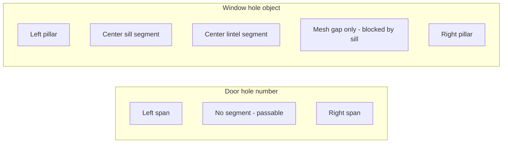

# US-14 — Wall windows — Design

Delta over [`specs/current/design.md`](../current/design.md) § Interior collision / arena-01 houses.

## Current behavior

Doors use `HouseSide` with an optional numeric `hole`:

```
// house-helpers.ts (today)
export type HouseSide
  = | 'full'
    | 'open'
    | { hole?: number; height?: HouseWallHeight };
```

[`wall-segment-helpers.ts`](../../src/modules/scenarios/pieces/wall-segment-helpers.ts) splits a wall into **two spans** around the gap. No segment exists in the opening → **passable** in XZ collision ([`resolve-player-collision.ts`](../../src/modules/game/utils/resolve-player-collision.ts) uses segment presence; `collisionHoles` metadata is informational only).

Mesh boxes are built from [`ScenarioWallSegment`](../../src/modules/scenarios/types.ts) with height from ground (`y = 0`); [`wall-mesh-builders.ts`](../../src/modules/scenarios/utils/wall-mesh-builders.ts) positions each box at `height / 2`.

## Proposed API

Extend types in [`house-helpers.ts`](../../src/modules/scenarios/pieces/house-helpers.ts):

```typescript
/** Door: full-height passable opening (meters). */
export type WallDoorHole = number;

/** Window: partial-height blocked opening. */
export interface WallWindowHole {
  width: number;
  height: number;
  /** Sill height above ground (m). Default: 1.0 */
  bottom?: number;
}

export type WallOpening = WallDoorHole | WallWindowHole;

export type HouseSide
  = 'full' | 'open' | { hole?: WallOpening; height?: HouseWallHeight };
```

**Examples:**

```
// Door (unchanged)
walls: { north: { hole: 2.2 } }

// Window
walls: { east: { hole: { width: 1.2, height: 1.0, bottom: 1.2 } } }
```

## Segment layout



| Opening type                              | Horizontal split                        | Center column                                                                                                         | Collision |
| ----------------------------------------- | --------------------------------------- | --------------------------------------------------------------------------------------------------------------------- | --------- |
| **Door** (`number`)                       | Left + right spans (full side height)   | **empty**                                                                                                             | Passable  |
| **Window** (`{ width, height, bottom? }`) | Left + right pillars (full side height) | **sill** (`baseY: 0`, `height: bottom`) + **lintel** (`baseY: bottom + windowHeight`, `height: wallTop − lintelBase`) | Blocked   |

### Validation

- Reject if `width >= totalLength - 0.6` → solid wall (existing door rule).
- Reject if `bottom + height >= sideWallHeight - 0.1` → solid wall (degenerate lintel).
- `bottom` defaults to `1.0` m when omitted.

### `ScenarioWallSegment.baseY`

Add optional `baseY?: number` to [`ScenarioWallSegment`](../../src/modules/scenarios/types.ts). Default `0`. Thread through:

- [`wall-helpers.ts`](../../src/modules/scenarios/pieces/wall-helpers.ts) — optional `baseY` on `wallAlongX` / `wallAlongZ`
- [`wall-mesh-builders.ts`](../../src/modules/scenarios/utils/wall-mesh-builders.ts) — position at `[baseY + height / 2]` instead of `height / 2`
- [`collision-helpers.ts`](../../src/modules/scenarios/pieces/collision-helpers.ts) — pass `baseY` through (future-proof; collision remains XZ-only today)

### `collisionHole()`

Continue emitting metadata for **doors only**. Windows are not passable spans — no `CollisionHole` entry.

Extract shared helper: `parseOpening(side) → { kind: 'none' | 'door' | 'window', ... }` in `wall-segment-helpers.ts`.

## arena-01 placement

Add windows to 2–3 footprints in [`maps/arena-01/houses.ts`](../../src/modules/scenarios/maps/arena-01/houses.ts) and/or update a preset in [`house-presets.ts`](../../src/modules/scenarios/pieces/house-presets.ts). Suggested candidates:

- `house-left-large` — window on a solid side (e.g. west) while keeping east/north doors
- `house-center-tall` — window on south or west
- `ruinedCottage` preset — window on north alongside existing low wall variant

Door hole count in [`scenario-registry.test.ts`](../../tests/units/scenarios/scenario-registry.test.ts) will change — update expected `collisionHoles` length.

## Files touched

| Area   | Files                                                                                         |
| ------ | --------------------------------------------------------------------------------------------- |
| Spec   | `specs/us-14/*`, `specs/current/tasks.md`                                                     |
| Domain | `house-helpers.ts`, `wall-segment-helpers.ts`, `wall-helpers.ts`, `types.ts`                  |
| Render | `wall-mesh-builders.ts`                                                                       |
| Map    | `maps/arena-01/houses.ts`, optionally `house-presets.ts`                                      |
| Tests  | `collision-hole-math.test.ts`, `scenario-registry.test.ts`, optionally `wall-corners.test.ts` |

## Ship checklist

- Fold FR-70–FR-75 into `specs/current/requirements.md`
- Update `specs/current/design.md` § Interior collision / arena-01 houses
- Add **US-14** row to `specs/CHANGELOG.md`
- Delete `specs/us-14/`
