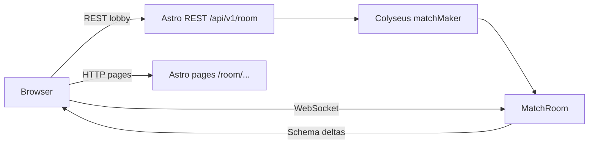
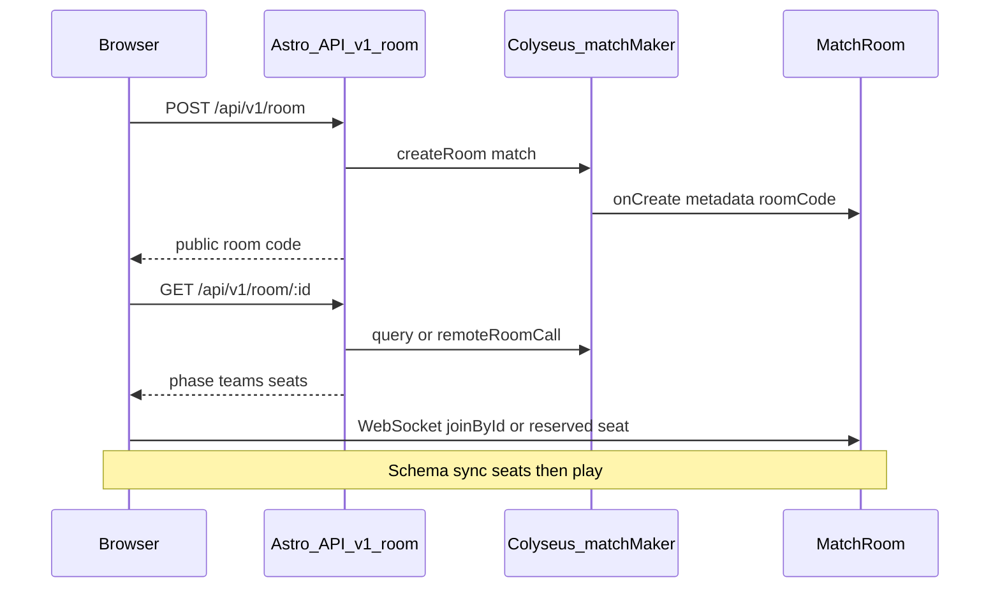

# US-5 — Design

## Stack

| Layer       | Choice                                      | Role                                                                                                  |
| ----------- | ------------------------------------------- | ----------------------------------------------------------------------------------------------------- |
| Astro       | `@astrojs/node` adapter, `output: 'server'` | HTTP pages (`/`, `/room/...`) + REST `/api/v1/room` + Node process — **already configured**           |
| Multiplayer | [Colyseus](https://colyseus.io/framework/)  | Rooms, Schema state sync, matchmaking, messages                                                       |
| Client SDK  | `@colyseus/sdk`                             | `joinById` / reserved seat, listen to state, `room.send`                                              |
| Lobby HTTP  | `@tanstack/react-query`                     | Island `useQuery` for `GET` snapshot (waiting-room poll); `useMutation` for create / join             |
| Game UI     | R3F island on `/room/{id}/play`             | Consumes `multiplayer/` adapter only — no Colyseus imports in combat / scenarios / soldiers / weapons |

Client domains reuse post type-split contracts: `HealthState` / `HitZone` (combat), `RoundPhase` (game), `Team`, `SoldierSkin`, `PistolWeaponConfig`.

## Architecture

Hybrid: **REST for lobby lifecycle** (create / status / seat / dispose), **WebSocket for presence and play**.





- **Astro Node** serves pages and `/api/v1/room` API routes.
- **Colyseus** runs in the **same Node process** — `matchMaker` is available to Astro `APIRoute` handlers after boot.
- Lobby UI uses REST for create / snapshot / seat / dispose; waiting room and `/play` use `@colyseus/sdk` via `colyseus-adapter`.
- REST is same-origin under Astro; WebSocket uses `PUBLIC_COLYSEUS_URL`.

### Boot wiring constraint

Astro `APIRoute` handlers must run only after Colyseus/`matchMaker` is initialized in the shared Node boot. If matchMaker is not ready, REST returns **`503`**. Keep adapter + room registration separate from page routes; wire both at server start.

- **Dev** (`npm run dev`): `src/modules/multiplayer/integration.ts` listens on `COLYSEUS_PORT` (default `2567`); client uses `PUBLIC_COLYSEUS_URL`.
- **Production** (`npm run build` → `npm run preview`): `src/server.ts` → `dist/server/custom-entry.mjs` attaches Colyseus to the same HTTP `$PORT` as Astro (Render-friendly). The browser client derives `ws:` / `wss:` from `location` (same host) so a leftover `localhost:2567` env cannot break deploy.

## Hybrid responsibilities

| Concern                          | HTTP REST (`/api/v1/room…`)                            | Colyseus WebSocket                           |
| -------------------------------- | ------------------------------------------------------ | -------------------------------------------- |
| Create room + short code         | Yes — `matchMaker.createRoom`                          | Also possible via SDK `create`               |
| Read status / open team slots    | Yes — `matchMaker.query` + metadata / `remoteRoomCall` | Better live via Schema                       |
| Actually sit in the lobby / play | No — HTTP cannot hold presence                         | **Required** — `joinById` / seat reservation |
| Transform / HP / shots           | No                                                     | **Required** — Schema + messages             |

## Lobby HTTP API

Public **`ROOM_ID`** is the existing 6-char code from [`src/modules/lobby/utils/generate-room-id.ts`](../../src/modules/lobby/utils/generate-room-id.ts). Store it in Colyseus room **metadata** as `roomCode`. Colyseus may keep an internal `roomId`; **REST always speaks the public code**. Look up rooms via `matchMaker.query` on metadata (or an equivalent code→room map).

Cap: `maxClients: 8`, `maxPerTeam: 4` (4 vs 4).

### Shared response shapes

```typescript
interface TeamSeatSummary {
  count: number;
  max: 4;
  open: boolean; // count < max
}

interface RoomSnapshot {
  id: string; // public roomCode
  phase: 'waiting' | 'in_progress' | 'ended';
  canJoin: boolean; // phase === 'waiting' && playerCount < 8
  maxPerTeam: 4;
  playerCount: number;
  scenario?: string;
  teams: {
    civilian: TeamSeatSummary;
    soldier: TeamSeatSummary;
  };
}
```

### `POST /api/v1/room`

- Creates a Colyseus `MatchRoom` via `matchMaker.createRoom('match', options)` with `maxClients: 8`.
- Body (host prefs, align US-7 session): `{ team?: Team; skin?: SoldierSkinId; scenario?: ScenarioId }`.
- Generates public `roomCode`, sets room metadata `{ roomCode, scenario, … }`.
- Response **`201`**: `RoomSnapshot` with `phase: 'waiting'`.
- Errors: **`503`** if matchMaker not ready; **`400`** invalid body.

### `GET /api/v1/room/:roomId`

- Existence + `RoomSnapshot` for lobby UI polling (invite pages, waiting room) before WS connect.
- Response **`200`**: `RoomSnapshot` (`phase`, `canJoin`, per-team seats, optional `scenario` / `playerCount`).
- **`404`** if unknown / disposed.

### `PUT /api/v1/room/:roomId`

- **Lobby seat claim / update** (not WebSocket join): validate `phase === 'waiting'`, team capacity `count < 4`.
- Body: `{ team: Team; skin: SoldierSkinId }` (both required; skin must belong to that team).
- Response **`200`**: `{ snapshot: RoomSnapshot; reservation }` where `reservation` is the Colyseus `ISeatReservation` from `matchMaker.reserveSeatFor` (`sessionId`, `roomId`, `name`, …) so the client can `consumeSeatReservation`.
- Errors: **`404`** unknown; **`409`** full / wrong phase / team full; **`400`** invalid body; **`503`** matchMaker not ready.

### `DELETE /api/v1/room/:roomId`

- Host (or round-end **Home**) disposes the Colyseus room: broadcasts `roomClosed` so every connected client clears session and navigates to `/`, then disconnects.
- Response **`204`**; **`404`** if unknown.

### Join for presence / play

After REST create or PUT, client connects with `joinById` (or reserved seat) on waiting-room and/or play mount — see client adapter. Live seat lists prefer Schema sync over polling once connected.

## Server layout

```
src/
├── pages/
│   ├── room/…                    # US-7 lobby pages
│   └── api/v1/room/
│       ├── index.ts              # POST create
│       └── [roomId]/index.ts     # GET snapshot / PUT seat / DELETE
└── modules/multiplayer/
    ├── adapters/
    │   ├── colyseus-adapter/     # client-facing API (index: initMatch, sync, listeners)
    │   ├── decode-*.ts / to-room-snapshot.ts  # REST DTO mappers
    ├── handlers/                 # Astro APIRoute implementations (pages stay thin)
    ├── rooms/
    │   └── MatchRoom.ts          # single room: waiting → in_progress → ended
    ├── schema/
    │   ├── PlayerState.ts
    │   └── MatchState.ts
    └── stores/
        └── multiplayer-store/    # remote players + round phase (index: useMultiplayerStore)
```

**One `MatchRoom`** with `roundPhase: waiting → in_progress → ended` (no separate LobbyRoom → MatchRoom migrate for MVP).

Register rooms when the Node server boots (Colyseus attach to Astro Node server hook). Keep adapter + room separation.

## Schema state

```typescript
// PlayerState (per client.sessionId)
{
  x: number;
  y: number;
  z: number;
  rotY: number;
  hp: number;
  eliminated: boolean;
  team: 'civilian' | 'soldier';
  skin: string; // SoldierSkinId
}

// MatchState
{
  players: MapSchema<PlayerState>;
  // Map to client RoundPhase in adapter where useful ('live' | 'round-end')
  roundPhase: 'waiting' | 'in_progress' | 'ended';
  winner: string; // team id or ''
  scenario: string;
  maxPerTeam: 4; // constant for MVP
}
```

- `onJoin`: reject if `players.size >= 8` or team count for requested team `>= 4`.
- REST PUT enforces the same caps before reservation.
- Room metadata includes `roomCode` for REST lookup.

## Client adapter

```
// src/modules/multiplayer/adapters/colyseus-adapter/ (public entry: index.ts)
initMatch({ roomId, reservation?, options?, endpoint? }) → MatchHandle { localPlayerId, players, … }
syncTransform({ x, z, yaw })            // throttled ~20 Hz
sendShot({ targetId, zone })           // server ShotMessage wire shape
startMatch()                            // host-only: waiting → in_progress
onPlayerUpdate(callback)               // full player snapshot per state change
onRoundUpdate(callback)                // roundPhase + winner deltas
onLeave(callback)
```

- `initMatch` → consumes the seat reservation from `PUT` (`client.consumeSeatReservation`) or, without one (host after create), `client.joinById(colyseusRoomId, options)`; joins with schema `MatchStateSchema`
- `roomId` is the **Colyseus internal room id** (from the reservation or a lookup), not the public 6-char code
- Transforms: the server mutates player Schema state in its `move` handler; client sends `room.send('move', { x, y, z, rotY })` throttled to ~20 Hz
- Shots: `room.send('shot', { targetId, zone })`; server validates (phase, alive, friendly-fire) and applies damage / `eliminated` — clients never decide kills in multiplayer
- Round wipe: server runs `checkRoundEnd`, mutates `roundPhase` / `winner`; clients react to Schema deltas only (no shot broadcast needed)
- Lobby pages do **not** import Colyseus — call REST; waiting/play consume the adapter only

## Round sync (server-authoritative)

- Host or ready flow moves `roundPhase` from `waiting` → `countdown` → `in_progress` (lock joins / set `canJoin: false`): host (first joiner) sends `startRound`; waits for the room to fill any number of players — no minimum
- `startRound` also `lock()`s the room client-side and server-side: REST `PUT` returns `409` outside `waiting`, `onJoin`/`joinById` reject, and room `canJoin` is false. Reserved seats (guests who already claimed seats) still connect after the lock
- Server tracks `hostSessionId` (first to join; reassigned on host leave) and gates `startRound` to that client while the room is `waiting` or `ended`
- Server assigns / validates teams on join / round start (respect preferred team when capacity allows)
- Server detects team wipe → sets `winner`, `roundPhase: 'ended'` and stays there until the host sends `startRound` again (no auto-timer)
- Host `startRound` is allowed from `waiting` or `ended` → resets HP / eliminated, places each player on their join spawn slot, sets `roundPhase: 'countdown'` with `countdown: 3`, then ticks 3→2→1 (1s each) before `in_progress`. Clients on `/play` show a full-screen **Get Ready** countdown overlay (above loaders). Waiting room navigates to `/play` when countdown (or live) begins. Move/shot stay locked until `in_progress`. Local FPS snaps to spawn and clears dying on entering `countdown`.
- Clients react to Schema changes only — do not decide round winners locally in multiplayer mode

## Integration

- Create/join forms → `POST` / `PUT` `/api/v1/room` via TanStack Query mutations; write `sessionStorage` as today (US-7) plus server room code
- Host waiting room **Close Room** → `DELETE /api/v1/room/{id}` then clear session and return to create
- Waiting room / invite snapshot → `useQuery` on `GET /api/v1/room/{id}` (`queryKey: ['room', roomId]`); waiting room polls every 2s while `phase === 'waiting'`. Stop polling once Colyseus Schema sync is on that page.
- `GameCanvas` calls adapter on mount
- The waiting room joins the match early: `useMatchJoin` claims a seat if the session has no reservation (host create does not claim one), then `initMatch(reservation)` + `bindMatch`. Joining happens while `waiting` because the server rejects fresh joins after the round starts. `/play` also calls `useMatchJoin`: after a hard navigation it reconnects with the persisted `room.reconnectionToken`. `MatchRoom.onLeave` always `allowReconnection`s (~60s) — browser navigations often close with a "normal" code that Colyseus marks consented, which would otherwise drop the seat immediately. Consumed seat reservations are cleared from sessionStorage (only the reconnect token is kept). If reconnect fails, the play island shows the error plus **Create a Room**.
- `LocalPlayer` / FPS controls sync local transform (throttled): `LocalTransformSync` mounts in the Canvas, reads the shared `player-state` transform per frame and forwards via the adapter proxy; the match handle coalesces to ~20 Hz (`TRANSFORM_SYNC_INTERVAL_MS`). No-op without an active match.
- `useShooting` calls `sendShot`; opposing team only. Hit detection stays client-side (raycast against peer hitboxes); damage, elimination, and round end are server-authoritative — in match mode `useShooting` never calls local `applyDamage` / `checkAndEndRound`
- `bindMatch(handle)` feeds an active match into the stores: player/round snapshots → multiplayer store; local player HP mirrors into `useHealthStore[LOCAL_PLAYER_ENTITY_ID]` (HealthBar, movement freeze, dying pose all reuse the solo path); HP drops trigger `requestHitReaction` (flinch) for the survivor, keyed to `LOCAL_PLAYER_ENTITY_ID` locally and session ids for peers; unbind clears stores on leave
- Bots are disabled while a match is connected (`ScenarioSoldiers` skipped) — opponents are the `RemotePlayers`; `RoundEndBanner` reads the multiplayer store `phase`/`winner` in match mode
- `RemotePlayer` reads remote players from multiplayer store (fed by Schema callbacks); skin comes from the store roster; locomotion is inferred from transform deltas; transforms are applied via `getState()` in `useFrame`
- Round-end: schema `roundPhase: ended` (+ `roundEnd` message) maps to the multiplayer store; `RoundEndBanner` reads that store while connected. Centered overlay shows **Restart** (host / offline) and **Home**. **Home** calls `DELETE /api/v1/room/{id}` → server `roomClosed` → all clients clear session and go `/`. No auto-reset of the round.

## Astro config (US-5)

```js
import node from '@astrojs/node';

export default defineConfig({
  output: 'server',
  adapter: node({ mode: 'standalone' }),
  // …
});
```

## Env

| Variable              | Purpose                                                                                                          |
| --------------------- | ---------------------------------------------------------------------------------------------------------------- |
| `PUBLIC_COLYSEUS_URL` | Dev client WebSocket endpoint (e.g. `ws://localhost:2567`). Prod uses same-origin `ws`/`wss` from the page host. |
| `COLYSEUS_PORT`       | Dev-only Colyseus listen port (default `2567`)                                                                   |

REST lobby routes are same-origin (no extra public URL). They require matchMaker in-process.

## Dependencies (US-5)

- `colyseus`, `@colyseus/schema` (server)
- `@colyseus/sdk` (client)
- `@astrojs/node` (Astro adapter)

## Out of scope (US-5)

- Colyseus Cloud deployment (local / self-hosted Node first)
- Pure HTTP gameplay (no WebSocket)
- Replacing Colyseus with a custom REST-only session store
- Separate LobbyRoom → MatchRoom migration
- Playroom Kit (removed)
