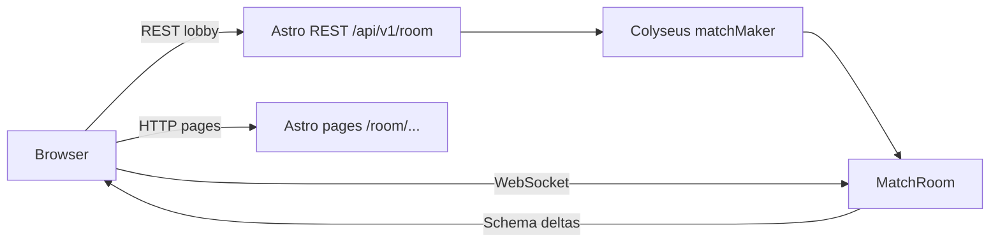
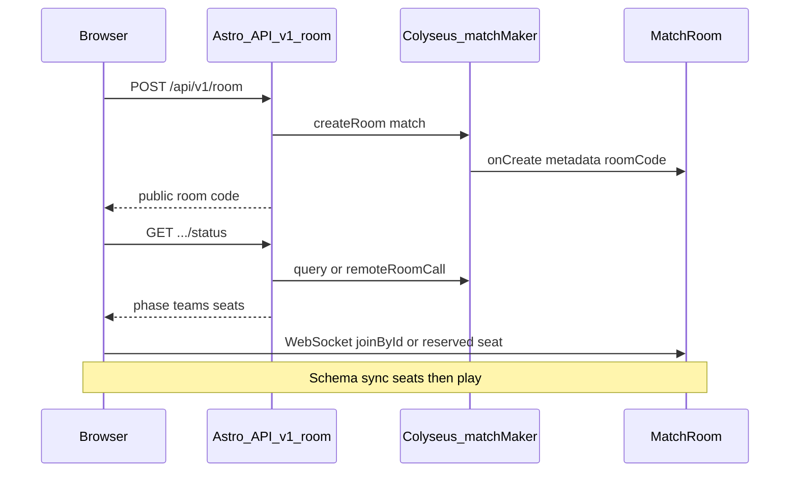

# US-5 — Design

## Stack

| Layer       | Choice                                      | Role                                                                                                  |
| ----------- | ------------------------------------------- | ----------------------------------------------------------------------------------------------------- |
| Astro       | `@astrojs/node` adapter, `output: 'server'` | HTTP pages (`/`, `/room/...`) + REST `/api/v1/room` + Node process — **already configured**           |
| Multiplayer | [Colyseus](https://colyseus.io/framework/)  | Rooms, Schema state sync, matchmaking, messages                                                       |
| Client SDK  | `@colyseus/sdk`                             | `joinById` / reserved seat, listen to state, `room.send`                                              |
| Game UI     | R3F island on `/room/{id}/play`             | Consumes `multiplayer/` adapter only — no Colyseus imports in combat / scenarios / soldiers / weapons |

Client domains reuse post type-split contracts: `HealthState` / `HitZone` (combat), `RoundPhase` (game), `Team`, `SoldierSkin`, `PistolWeaponConfig`.

## Architecture

Hybrid: **REST for lobby lifecycle** (create / status / seat / dispose), **WebSocket for presence and play**.





- **Astro Node** serves pages and `/api/v1/room` API routes.
- **Colyseus** runs in the **same Node process** — `matchMaker` is available to Astro `APIRoute` handlers after boot.
- Lobby UI uses REST for create/status/seat/dispose; waiting room and `/play` use `@colyseus/sdk` via `colyseus-adapter`.
- REST is same-origin under Astro; WebSocket uses `PUBLIC_COLYSEUS_URL`.

### Boot wiring constraint

Astro `APIRoute` handlers must run only after Colyseus/`matchMaker` is initialized in the shared Node boot. If matchMaker is not ready, REST returns **`503`**. Keep adapter + room registration separate from page routes; wire both at server start.

## Hybrid responsibilities

| Concern                          | HTTP REST (`/api/v1/room…`)                                 | Colyseus WebSocket                           |
| -------------------------------- | ----------------------------------------------------------- | -------------------------------------------- |
| Create room + short code         | Yes — `matchMaker.createRoom`                               | Also possible via SDK `create`               |
| Read status / open team slots    | Yes — `matchMaker.query` + metadata / `remoteRoomCall`      | Better live via Schema                       |
| Actually sit in the lobby / play | No — HTTP cannot hold presence                              | **Required** — `joinById` / seat reservation |
| Transform / HP / shots           | No                                                          | **Required** — Schema + messages             |

## Lobby HTTP API

Public **`ROOM_ID`** is the existing 6-char code from [`src/modules/lobby/utils/generate-room-id.ts`](../../src/modules/lobby/utils/generate-room-id.ts). Store it in Colyseus room **metadata** as `roomCode`. Colyseus may keep an internal `roomId`; **REST always speaks the public code**. Look up rooms via `matchMaker.query` on metadata (or an equivalent code→room map).

Cap: `maxClients: 8`, `maxPerTeam: 4` (4 vs 4).

### Shared response shapes

```typescript
type TeamSeatSummary = {
  count: number;
  max: 4;
  open: boolean; // count < max
};

type RoomSnapshot = {
  id: string; // public roomCode
  phase: 'waiting' | 'in_progress' | 'ended';
  canJoin: boolean; // phase === 'waiting' && playerCount < 8
  maxPerTeam: 4;
  playerCount: number;
  scenario?: string;
  teams: {
    civilian: TeamSeatSummary;
    soldier: TeamSeatSummary;
  };
};
```

### `POST /api/v1/room`

- Creates a Colyseus `MatchRoom` via `matchMaker.createRoom('match', options)` with `maxClients: 8`.
- Body (host prefs, align US-7 session): `{ team?: Team; skin?: SoldierSkinId; scenario?: ScenarioId }`.
- Generates public `roomCode`, sets room metadata `{ roomCode, scenario, … }`.
- Response **`201`**: `RoomSnapshot` with `phase: 'waiting'`.
- Errors: **`503`** if matchMaker not ready; **`400`** invalid body.

### `GET /api/v1/room/:roomId`

- Existence + snapshot (full `RoomSnapshot` or thinner subset).
- **`404`** if unknown / disposed.

### `PUT /api/v1/room/:roomId`

- **Lobby seat claim / update** (not WebSocket join): validate `phase === 'waiting'`, team capacity `count < 4`.
- Body: `{ team: Team; skin: SoldierSkinId }`.
- Response **`200`**: updated `RoomSnapshot`; prefer including a Colyseus **seat reservation** token (`matchMaker.reserveSeatFor`) so WebSocket join is authorized.
- Errors: **`404`** unknown; **`409`** full / wrong phase / team full; **`400`** invalid body; **`503`** matchMaker not ready.

### `DELETE /api/v1/room/:roomId`

- Host (or empty-room cleanup) disposes the Colyseus room.
- Response **`204`**; **`404`** if unknown.

### `GET /api/v1/room/:roomId/status`

- Source of truth for lobby UI polling before WS connect (and invite pages).
- Response **`200`**: `RoomSnapshot` (`phase`, `canJoin`, per-team seats, optional `scenario` / `playerCount`).
- **`404`** if unknown / disposed.

### Join for presence / play

After REST create or PUT, client connects with `joinById` (or reserved seat) on waiting-room and/or play mount — see client adapter. Live seat lists prefer Schema sync over polling once connected.

## Server layout

```
src/
├── pages/
│   ├── room/…                    # US-7 lobby pages
│   └── api/v1/room/
│       ├── index.ts              # POST create
│       ├── [roomId].ts           # GET / PUT / DELETE
│       └── [roomId]/status.ts    # GET status
└── modules/multiplayer/
    ├── adapters/
    │   └── colyseus-adapter.ts   # client-facing API used by GameCanvas / waiting room
    ├── rooms/
    │   └── MatchRoom.ts          # single room: waiting → in_progress → ended
    ├── schema/
    │   ├── PlayerState.ts
    │   └── MatchState.ts
    └── stores/
        └── multiplayer-store.ts
```

**One `MatchRoom`** with `roundPhase: waiting → in_progress → ended` (no separate LobbyRoom → MatchRoom migrate for MVP).

Register rooms when the Node server boots (Colyseus attach to Astro Node server hook). Keep adapter + room separation.

## Schema state

```typescript
// PlayerState (per client.sessionId)
{
  x: number;
  y: number;
  z: number;
  rotY: number;
  hp: number;
  eliminated: boolean;
  team: 'civilian' | 'soldier';
  skin: string; // SoldierSkinId
}

// MatchState
{
  players: MapSchema<PlayerState>;
  // Map to client RoundPhase in adapter where useful ('live' | 'round-end')
  roundPhase: 'waiting' | 'in_progress' | 'ended';
  winner: string; // team id or ''
  scenario: string;
  maxPerTeam: 4; // constant for MVP
}
```

- `onJoin`: reject if `players.size >= 8` or team count for requested team `>= 4`.
- REST PUT enforces the same caps before reservation.
- Room metadata includes `roomCode` for REST lookup.

## Client adapter

```
// src/modules/multiplayer/adapters/colyseus-adapter.ts
initMatch({ roomId, reservation? }) → { room, localPlayerId, players }
syncTransform({ x, y, z, rotY })
sendShot({ origin, direction })
onPlayerUpdate(callback)
onShotReceived(callback)
onRoundUpdate(callback)
```

- `initMatch` → `client.joinById(colyseusRoomId, options)` or consume seat reservation from PUT
- Transforms: patch local player Schema fields (throttled ~20 Hz) or `room.send('move', …)` if server mutates state
- Shots: `room.send('shot', payload)`; server validates / applies damage / mutates `hp` / `eliminated`
- Round wipe: server runs `checkRoundEnd`; clients listen to `roundPhase` / `winner`
- Lobby pages do **not** import Colyseus — call REST; waiting/play use adapter only

## Round sync (server-authoritative)

- Host or ready flow moves `roundPhase` from `waiting` → `in_progress` (lock joins / set `canJoin: false`)
- Server assigns / validates teams on join / round start (respect preferred team when capacity allows)
- Server detects team wipe → sets `winner`, `roundPhase: 'ended'` → after delay, reset players and `roundPhase: 'in_progress'`
- Clients react to Schema changes only — do not decide round winners locally in multiplayer mode

## Integration

- Create/join forms → `POST` / `PUT` `/api/v1/room`; write `sessionStorage` as today (US-7) plus server room code
- Waiting room → poll or one-shot `GET …/status`; optionally open WS early for live roster
- `GameCanvas` calls adapter on mount
- `LocalPlayer` / FPS controls sync local transform (throttled)
- `useShooting` calls `sendShot`; opposing team only
- `RemotePlayer` reads remote players from multiplayer store (fed by Schema callbacks)

## Astro config (US-5)

```js
import node from '@astrojs/node';

export default defineConfig({
  output: 'server',
  adapter: node({ mode: 'standalone' }),
  // …
});
```

## Env

| Variable              | Purpose                                                                    |
| --------------------- | -------------------------------------------------------------------------- |
| `PUBLIC_COLYSEUS_URL` | Client WebSocket endpoint (e.g. `ws://localhost:2567` or same-origin path) |
| `COLYSEUS_PORT`       | Optional if Colyseus listens on a dedicated port                           |

REST lobby routes are same-origin (no extra public URL). They require matchMaker in-process.

## Dependencies (US-5)

- `colyseus`, `@colyseus/schema` (server)
- `@colyseus/sdk` (client)
- `@astrojs/node` (Astro adapter)

## Out of scope (US-5)

- Colyseus Cloud deployment (local / self-hosted Node first)
- Pure HTTP gameplay (no WebSocket)
- Replacing Colyseus with a custom REST-only session store
- Separate LobbyRoom → MatchRoom migration
- Playroom Kit (removed)
