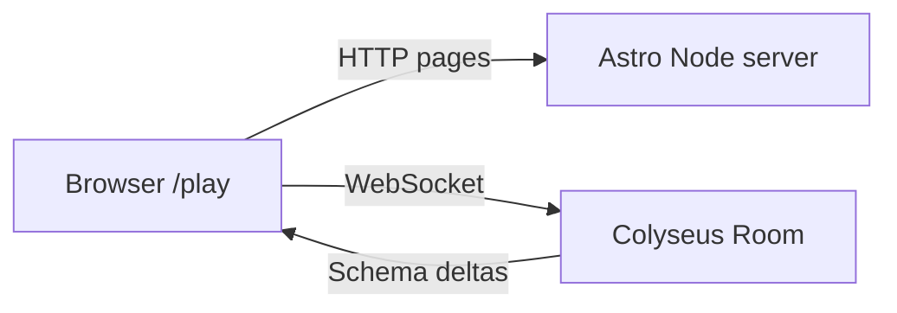

# US-5 — Design

## Stack

| Layer       | Choice                                      | Role                                                                                                  |
| ----------- | ------------------------------------------- | ----------------------------------------------------------------------------------------------------- |
| Astro       | `@astrojs/node` adapter, `output: 'server'` | HTTP pages (`/`, `/play`) + Node process — **already configured**                                     |
| Multiplayer | [Colyseus](https://colyseus.io/framework/)  | Rooms, Schema state sync, matchmaking, messages                                                       |
| Client SDK  | `@colyseus/sdk`                             | `joinOrCreate`, listen to state, `room.send`                                                          |
| Game UI     | R3F island on `/play`                       | Consumes `multiplayer/` adapter only — no Colyseus imports in combat / scenarios / soldiers / weapons |

Client domains reuse post type-split contracts: `HealthState` / `HitZone` (combat), `RoundPhase` (game), `Team`, `SoldierSkin`, `PistolWeaponConfig`.

## Architecture



- **Astro Node** serves the site (SSR/static hybrid as needed).
- **Colyseus** runs in the same Node process (or sibling process sharing the HTTP server) — room matchmaking + authoritative game state.
- Client connects with `@colyseus/sdk` to the Colyseus endpoint (env-configured URL).

## Server layout

```
src/
├── pages/                 Astro routes
└── modules/multiplayer/
    ├── adapters/
    │   └── colyseus-adapter.ts   # client-facing API used by GameCanvas
    ├── rooms/
    │   └── MatchRoom.ts          # Colyseus Room (server)
    ├── schema/
    │   ├── PlayerState.ts
    │   └── MatchState.ts
    └── stores/
        └── multiplayer-store.ts
```

Register rooms when the Node server boots (Colyseus `defineServer` / attach to Astro Node `createServer` hook — exact wiring TBD at implement time; keep adapter + room separation).

## Schema state

```typescript
// PlayerState (per client.sessionId)
{
  x: number;
  y: number;
  z: number;
  rotY: number;
  hp: number;
  eliminated: boolean;
  team: 'civilian' | 'soldier';
}

// MatchState
{
  players: MapSchema<PlayerState>;
  // Align client RoundPhase where useful: 'live' | 'round-end'
  // Schema may keep waiting/in_progress/ended for lobby; map in adapter
  roundPhase: 'waiting' | 'in_progress' | 'ended';
  winner: string; // team id or ''
}
```

## Client adapter

```
// src/modules/multiplayer/adapters/colyseus-adapter.ts
initMatch() → { room, localPlayerId, players }
syncTransform({ x, y, z, rotY })
sendShot({ origin, direction })
onPlayerUpdate(callback)
onShotReceived(callback)
onRoundUpdate(callback)
```

- `initMatch` → `client.joinOrCreate('match', options)`
- Transforms: patch local player Schema fields (throttled ~20 Hz) or `room.send('move', …)` if server mutates state
- Shots: `room.send('shot', payload)`; server validates / applies damage / mutates `hp` / `eliminated`
- Round wipe: server runs `checkRoundEnd`; clients listen to `roundPhase` / `winner`

## Round sync (server-authoritative)

- Server assigns teams on join / round start
- Server detects team wipe → sets `winner`, `roundPhase: 'ended'` → after delay, reset players and `roundPhase: 'in_progress'`
- Clients react to Schema changes only — do not decide round winners locally in multiplayer mode

## Integration

- `GameCanvas` calls adapter on mount
- `LocalPlayer` / FPS controls sync local transform (throttled)
- `useShooting` calls `sendShot`; opposing team only
- `RemotePlayer` reads remote players from multiplayer store (fed by Schema callbacks)

## Astro config (US-5)

```js
import node from '@astrojs/node';

export default defineConfig({
  output: 'server',
  adapter: node({ mode: 'standalone' }),
  // …
});
```

## Env

| Variable              | Purpose                                                                    |
| --------------------- | -------------------------------------------------------------------------- |
| `PUBLIC_COLYSEUS_URL` | Client WebSocket endpoint (e.g. `ws://localhost:2567` or same-origin path) |
| `COLYSEUS_PORT`       | Optional if Colyseus listens on a dedicated port                           |

## Dependencies (US-5)

- `colyseus`, `@colyseus/schema` (server)
- `@colyseus/sdk` (client)
- `@astrojs/node` (Astro adapter)

## Out of scope (US-5)

- Colyseus Cloud deployment (local / self-hosted Node first)
- Playroom Kit (removed)
