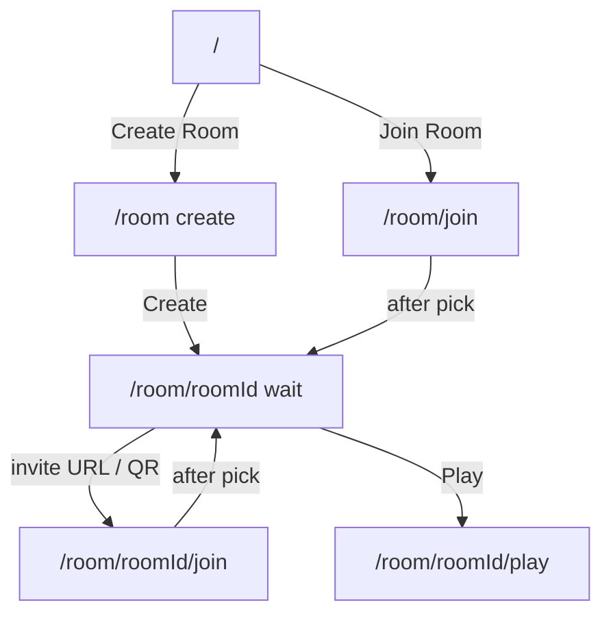

# US-7 — Design

Depends on **US-6** _(shipped)_ skins (`remy` / `james` / `liza`, `swat-1` / `swat-2` / `swat-3`) and shared idle for character preview. Does not own animation retarget or crouch-walk.

Local-first: create/join/waiting work without a game server. US-5 wires the same room routes to Colyseus rooms.

## Routing



| Route                 | Astro page                            | Island notes                                                     |
| --------------------- | ------------------------------------- | ---------------------------------------------------------------- |
| `/`                   | `src/pages/index.astro`               | **Create Room** → `/room`; **Join Room** → `/room/join`          |
| `/room`               | `src/pages/room/index.astro`          | React island; R3F for character turntable                        |
| `/room/join`          | `src/pages/room/join.astro`           | React island; **room id field** + avatar preview; no arena pick  |
| `/room/[roomId]`      | `src/pages/room/[roomId]/index.astro` | DOM-only island OK (share, QR, Play)                             |
| `/room/[roomId]/join` | `src/pages/room/[roomId]/join.astro`  | Same island; room id from path (shown, not typed); no arena pick |
| `/room/[roomId]/play` | `src/pages/room/[roomId]/play.astro`  | Game canvas island; boot from `sessionStorage`                   |
| `/play`               | `src/pages/play.astro` (legacy)       | e2e/dev probe (default `remy`; no query skin)                    |

Invalid / missing session on play: defaults `civilian`, `remy`, `arena-01` with team↔skin consistency (civilian → `remy`, soldier → `swat-1`).

## Session storage

Waiting URL stays clean (`/room/{roomId}` — no team/skin in the shareable wait link). After create or join picks, write:

```
sessionStorage[`cs:room:${roomId}`] = {
  team: Team;
  skin: SoldierSkinId;
  scenario: ScenarioId;   // create: chosen; join: arena-01 until host sync (US-5)
  role: 'host' | 'guest';
}
```

`/room/{roomId}/play` reads that key. Missing or invalid → defaults above.

Invite URL (share + QR) is path-only: `{origin}/room/{roomId}/join`.

## Landing

Replace single **Start Game** with:

- **Create Room** → `/room`
- **Join Room** → `/room/join` (room id is entered on the join page, not on `/`)

Keep brand / hero composition; one job for the CTA group. No root `/join` page.

## Create room (`/room`)

One job per section:

1. **Arena** — cards from scenario registry: display name + `previewImageUrl` or placeholder
2. **Team** — Civilian | Soldier
3. **Avatar** — skins filtered by team; R3F preview (selected `.glb` + shared idle, slow yaw/orbit)
4. **Create Room** — generate short random room id (client-side), write session (`role: 'host'`), navigate to `/room/{roomId}`

## Join room (`/room/join` and `/room/[roomId]/join`)

1. **Room id** — editable field on `/room/join`; from the path (shown read-only) on `/room/{roomId}/join`
2. **Team** + **Avatar** — same pickers / idle preview as create; joiner does **not** pick arena (“Host arena — synced later”)
3. Confirm — write session (`role: 'guest'`, `scenario: 'arena-01'` until US-5), navigate to `/room/{roomId}`

Landing **Join Room** opens `/room/join`. Invite links skip typing and open `/room/{roomId}/join`. Any non-empty id accepted locally until US-5 validates.

## Waiting room (`/room/[roomId]`)

- Room id, local player summary from session (team, skin name, arena name for host / placeholder for guest)
- Player list: local user only; empty slots or “Waiting for players…”
- **Invite share**:
  - Readonly input with `{origin}/room/{roomId}/join`
  - **Copy** control
  - **QR code** encoding that URL (client-side lib or canvas — pick a small dependency at implement time)
- Until US-5, opening the invite still yields local-only join → waiting alone; URL shape is the contract Colyseus will honor later
- Primary CTA **Play** → `/room/{roomId}/play`
- Secondary: back to `/room` (host) or stay on join path as appropriate

## Scenario registry

```
ScenarioConfig {
  // existing fields…
  previewImageUrl?: string | null;
}
```

- `arena-01`: `previewImageUrl: null` until art is uploaded
- `teamSpawns.civilian`: add ≥1 east spawn (Civilians east / Soldiers west)

## Skin ↔ team

| Team       | Skin ids                     | Default  |
| ---------- | ---------------------------- | -------- |
| `civilian` | `remy`, `james`, `liza`      | `remy`   |
| `soldier`  | `swat-1`, `swat-2`, `swat-3` | `swat-1` |

Changing team resets character to that team’s default skin if the current skin is invalid for the new team.

## Legacy `/play`

Keep `src/pages/play.astro` for existing e2e/dev as a thin default-`remy` probe. Product flow and non-default skins use `/room/{roomId}/play` + `sessionStorage`.

## Handoff to US-5

US-5 consumes these room routes: wire create / join / play to Colyseus (`joinOrCreate` / `joinById`). See [`specs/us-5/requirements.md`](../us-5/requirements.md) US-5.3.

## Out of scope

- Colyseus create / join / sync / matchmaking (US-5)
- Host-driven arena lock for joiners (US-5)
- Image upload / CDN for arena art (field only)
- SMS / email invite providers
- Extra maps (registry already supports more when added)
- Shared clip pipeline / crouch-walk (shipped US-6)
- Removing legacy `/play` in this US
