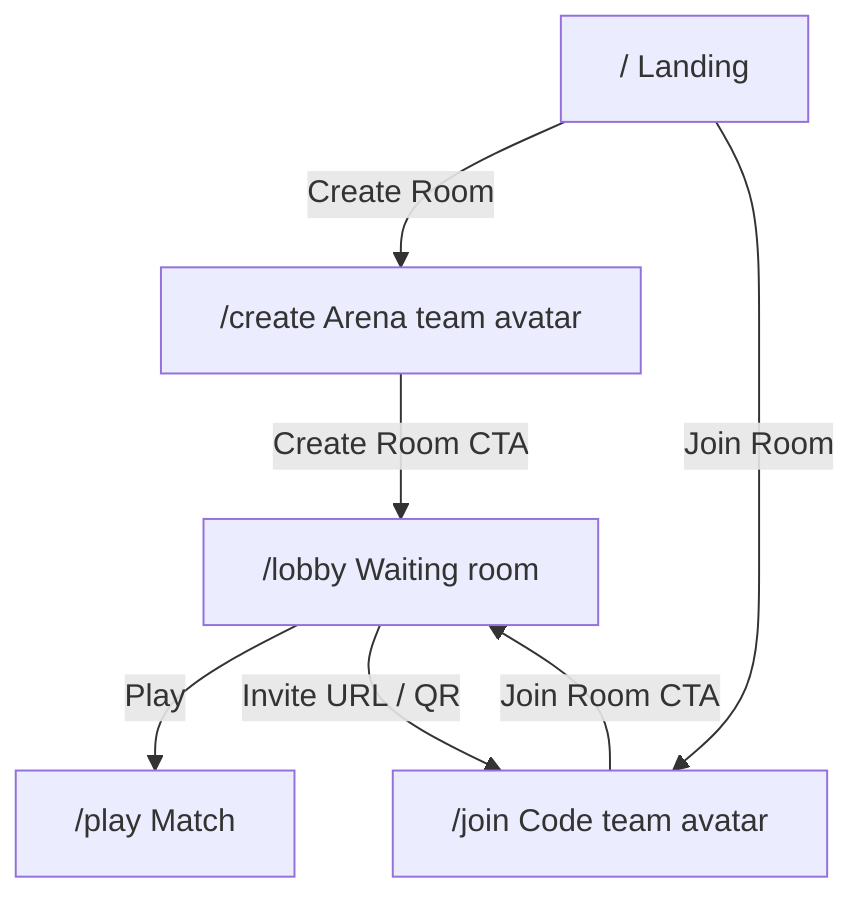

# US-7 — Design

Depends on **US-6** _(shipped)_ skins (`remy` / `james` / `liza`, `swat-1` / `swat-2` / `swat-3`) and shared idle for character preview. Does not own animation retarget or crouch-walk.

Local-first: create/join/lobby work without a game server. US-5 wires the same routes to Colyseus rooms.

## Routing



| Route     | Astro page               | Island notes                                                 |
| --------- | ------------------------ | ------------------------------------------------------------ |
| `/`       | `src/pages/index.astro`  | Dual CTAs: Create Room, Join Room                            |
| `/create` | `src/pages/create.astro` | React island; R3F only for character turntable               |
| `/join`   | `src/pages/join.astro`   | React island; R3F for avatar preview; prefill `?room=`       |
| `/lobby`  | `src/pages/lobby.astro`  | DOM-only island OK (share input, QR, Play) — no R3F required |
| `/play`   | existing                 | Boot from query params                                       |

Invalid / missing params on `/play`: defaults `civilian`, `remy`, `arena-01` with team↔skin consistency (civilian → `remy`, soldier → `swat-1`).

## Session query params

### `/lobby`

| Param      | Type               | Notes                                                             |
| ---------- | ------------------ | ----------------------------------------------------------------- |
| `mode`     | `create` \| `join` | Controls back-link and copy                                       |
| `room`     | string             | Local id (create) or opaque code (join)                           |
| `team`     | `Team`             | Local player team                                                 |
| `skin`     | `SoldierSkinId`    | Local player skin                                                 |
| `scenario` | `ScenarioId`       | Set on create; join defaults to `arena-01` until host sync (US-5) |

### `/play`

| Param      | Type            | Effect                                     |
| ---------- | --------------- | ------------------------------------------ |
| `team`     | `Team`          | `resolveLocalSpawn` uses that team’s slots |
| `skin`     | `SoldierSkinId` | `LocalPlayer` / model skin                 |
| `scenario` | `ScenarioId`    | `getScenarioById` (today only `arena-01`)  |

Local play **respects** the selected team once play boot lands. Networked assign may override (US-5).

## Landing

Replace single **Start Game** on `index.astro` with **Create Room** → `/create` and **Join Room** → `/join`. Keep brand / hero composition; one job for the CTA group.

## Create room (`/create`)

One job per section:

1. **Arena** — cards from scenario registry: display name + `previewImageUrl` or placeholder
2. **Team** — Civilian | Soldier
3. **Avatar** — skins filtered by team; R3F preview (selected `.glb` + shared idle, slow yaw/orbit)
4. **Create Room** — primary CTA → `/lobby?mode=create&room=<localId>&team=&skin=&scenario=`

Room id: short random string generated client-side (no server).

## Join room (`/join`)

1. **Room code** — text field; any non-empty code accepted locally until US-5 validates
2. **Team** + **Avatar** — same pickers / idle preview as create; joiner does **not** pick arena (“Host arena — synced later”)
3. **Join Room** → `/lobby?mode=join&room=<code>&team=&skin=` (`scenario` omitted or default `arena-01`)

When opened as `/join?room=<id>` (invite), prefill the room code field.

## Waiting room (`/lobby`)

- Room id/code, local player summary (team, skin name, arena name on create / placeholder on join)
- Player list: local user only; empty slots or “Waiting for players…”
- **Invite share** (required on create; same UI on join for consistency):
  - Readonly input with absolute invite URL: `{origin}/join?room=<id>`
  - **Copy** control
  - **QR code** encoding that URL (client-side lib or canvas — pick a small dependency at implement time)
- Until US-5, opening the invite still yields local-only join → lobby alone; URL shape is the contract Colyseus will honor later
- Primary CTA **Play** → `/play?team=&skin=&scenario=`
- Secondary: back to `/create` or `/join` from `mode`

## Scenario registry

```
ScenarioConfig {
  // existing fields…
  previewImageUrl?: string | null;
}
```

- `arena-01`: `previewImageUrl: null` until art is uploaded
- `teamSpawns.civilian`: add ≥1 east spawn (Civilians east / Soldiers west)

## Skin ↔ team

| Team       | Skin ids                     | Default  |
| ---------- | ---------------------------- | -------- |
| `civilian` | `remy`, `james`, `liza`      | `remy`   |
| `soldier`  | `swat-1`, `swat-2`, `swat-3` | `swat-1` |

Changing team resets character to that team’s default skin if the current skin is invalid for the new team.

## Handoff to US-5

US-5 consumes this lobby: wire Create / Join / Play to real Colyseus rooms. US-5.3’s “after Start Game” wording is superseded by Create Room / Join Room / lobby **Play** — see [`specs/us-5/requirements.md`](../us-5/requirements.md).

## Out of scope

- Colyseus create / join / sync / matchmaking (US-5)
- Host-driven arena lock for joiners (US-5)
- Image upload / CDN for arena art (field only)
- SMS / email invite providers
- Extra maps (registry already supports more when added)
- Shared clip pipeline / crouch-walk (shipped US-6)
