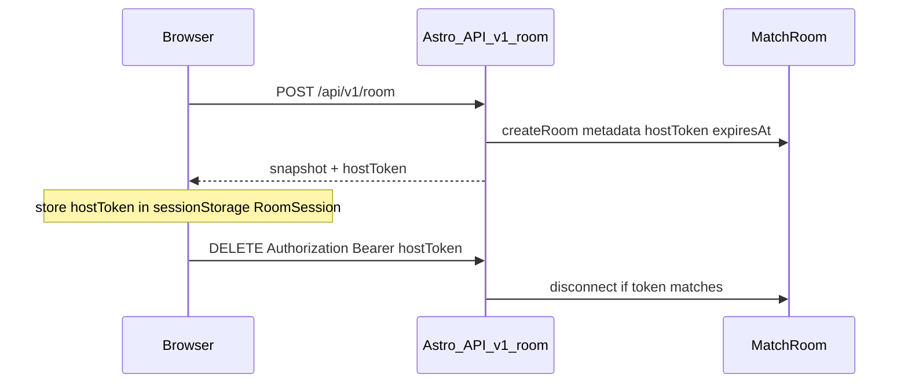

# US-8 — Design

## Threat model

Anonymous invite game: 6-char room codes, no accounts, no rankings. Primary risks:

- Anyone with a room code can `DELETE` the lobby today
- Scripted cross-origin / curl mutation of lobby REST
- Client-supplied `shot` / `move` payloads spoofing damage or teleports once US-5 adapter is live
- Orphaned waiting rooms and long-lived enumerable codes

## Boundary with US-5

| US-5                                                  | US-8                                   |
| ----------------------------------------------------- | -------------------------------------- |
| Adapter, Schema sync, server applies HP from messages | Make messages trustworthy (validation) |
| Lobby REST CRUD                                       | Host token, origin guard, room TTL     |

Do not re-do adapter / UI wiring here.

## Origin guard (US-8.1)

Shared helper (e.g. `src/modules/multiplayer/utils/request-guards.ts`):

- Apply to `POST` / `PUT` / `DELETE` only
- Allow when `Origin` (or `Referer` origin) matches configured `SITE` / request host
- Reject with `403` when present and mismatched; treat missing Origin on same-site navigations carefully (browsers may omit on some same-origin POSTs — prefer allow when both Origin and Referer absent **only** if that matches current browser behavior for same-origin fetch, else require Origin for API clients)
- Skip for `GET` snapshot (invite links need read-only access)

Cheap CSRF-ish guard — not a substitute for `hostToken`.

## Host token (US-8.2 / US-8.3)

- Generate cryptographically random opaque `hostToken` on create; store in Colyseus room **metadata** (never in Schema broadcast to all clients)
- Create response includes `hostToken` once (alongside snapshot); client stores it on [`RoomSession`](../../src/modules/lobby/utils/room-session.ts)
- `DELETE` requires `Authorization: Bearer <hostToken>`; compare with timing-safe equality; `401` if missing, `403` if wrong, `404` if room unknown
- Update [`delete-room`](../../src/modules/multiplayer/services/delete-room.ts) to send the header

## Shot validation (US-8.5) — slim v1

Extend [`MatchRoom`](../../src/modules/multiplayer/rooms/match-room.ts) `shot` handler:

1. `roundPhase === 'in_progress'`
2. Shooter exists, not eliminated
3. Target exists, not eliminated, opposing team
4. Distance(shooter, target) ≤ pistol max range (constant from weapons / combat)
5. Per-shooter fire-rate cooldown (reject if too soon)
6. `zone` ∈ `{ head, body, limb }` only — apply via existing [`applyDamage`](../../src/modules/combat/apply-damage.ts)

**Do not** port client `pick-bullet-hit` / Three raycasts to the server in this US. Full geometry authority is deferred.

## Move validation (US-8.6)

On `move` messages:

- Ignore if wrong phase / missing player
- Max horizontal (and vertical if needed) delta vs last accepted position per message / time window
- Drop or clamp outliers (prefer drop for cheaters; clamp if preferred for lag spikes — pick one in implementation and test)

## Room code TTL (US-8.9 / US-8.11)

- On create: `expiresAt = now + ROOM_CODE_TTL_MS` (default `2_400_000` = 40 min) in metadata
- Expose `expiresAt` on `RoomSnapshot` (lobby may show countdown later; optional UI)
- `MatchRoom.onCreate`: schedule dispose at `expiresAt`; clear timer in `onDispose`
- Shared `isRoomExpired(metadata)` — REST `GET` / `PUT` / `DELETE` return **`410 Gone`** `{ error: 'Room expired' }` when past expiry (dispose if still listed)
- Reject WS join after expiry (`onJoin` throws when `expiresAt` is past)
- **Restart:** host `startRound` (waiting → countdown or ended → countdown) calls `renewExpiry()` — new `expiresAt`, reschedule dispose timer; **`hostToken` stays the same** so the create-time bearer in `RoomSession` still authorizes `DELETE`

## Env

| Variable           | Purpose                                                            |
| ------------------ | ------------------------------------------------------------------ |
| `ROOM_CODE_TTL_MS` | Room lifetime from create / each round restart (default `2400000`) |
| `SITE`             | Allowed origin base for US-8.1 (already used by Astro config)      |

## Deferred

- Reservation-enforced join beyond US-5
- In-app rate limits / Redis
- HttpOnly cookies, accounts
- Server-side hitscan raycast
- API-key proxy pattern
