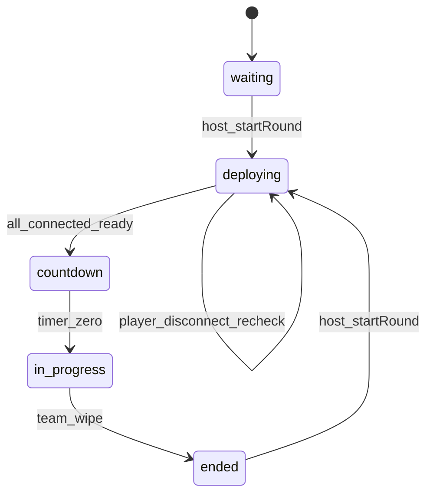
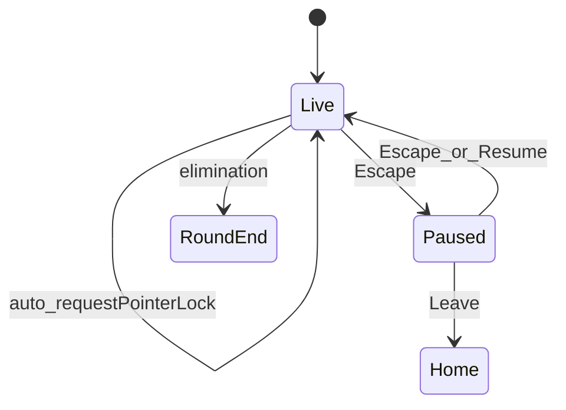

# US-9 — Design

## Problem

1. **Click-to-aim:** Pointer lock is acquired only on canvas click; crosshair is visible but mouse look is inactive until click.
2. **No in-match menu:** Escape does nothing; restart / leave exist only on the round-end banner.
3. **Countdown vs load race:** Server starts 3‑2‑1 immediately on host **Start Match** while clients may still show **Deploying** on `/play`.

## Boundary with shipped work

| Shipped                         | US-9                                                                 |
| ------------------------------- | -------------------------------------------------------------------- |
| `RoundEndBanner` Restart / Home | Pause **Restart** reuses same handlers; **Leave** ≠ Home (no DELETE) |
| `LoadingReporter` deploy UI     | Becomes the client **ready** signal                                  |
| `MatchRoom.startRound()`        | Split into deploy gate + delayed `beginCountdown()`                  |
| FR-3 pointer lock on click      | Auto-lock on **live** + click fallback                               |

## Round phase flow (multiplayer)



New server phase **`deploying`** sits between **`waiting`/`ended`** and **`countdown`**. REST snapshot maps `deploying` → lobby **`in_progress`** (joins stay locked, same as countdown today).

### Server (`MatchRoom`)

Extend [`match-state.ts`](../../src/modules/multiplayer/schema/match-state.ts):

- `MatchRoundPhase`: add `'deploying'`
- Per-player ready flag on `PlayerState` **or** a private `Set<string>` on the room (prefer **Schema field** `ready: boolean` on player so clients can show “2/3 ready” later)

Handler changes in [`match-room.ts`](../../src/modules/multiplayer/rooms/match-room.ts):

1. `startRound()` → respawn, lock, set `roundPhase = 'deploying'`, clear all `ready = false`, **do not** call `beginCountdown()`.
2. New `onMessage('playerReady')` → set player ready; if `everyConnectedPlayerReady()` → `beginCountdown()` (existing timer logic).
3. `onLeave` during **`deploying`**: if remaining players all ready → start countdown; else wait.
4. Reconnect: player joins with `ready = false`; must send `playerReady` again after load.

Map client phase in [`map-match-round-phase.ts`](../../src/modules/multiplayer/stores/multiplayer-store/map-match-round-phase.ts):

- `deploying` → client `'deploying'` (new `RoundPhase` or reuse a deploy flag — prefer explicit `'deploying'` in game types)

### Client deploy signal

[`game-canvas-island.tsx`](../../src/modules/game/components/game-canvas-island.tsx) already owns loader state from `LoadingReporter`.

When `onLoaderChange(null)`:

1. **Multiplayer:** `room.send('playerReady')` via adapter helper `sendPlayerReady()`.
2. **Offline:** call `startRound(scenarioId)` instead of on-mount (remove immediate `startRound` in [`game-canvas.tsx`](../../src/modules/game/components/game-canvas.tsx) `useEffect`).

Optional: also fire ready when joining `/play` mid-**deploying** after loader clears (same path).

### Deploy / countdown UI

Extend [`countdown-banner.tsx`](../../src/modules/game/components/countdown-banner.tsx) (or sibling `DeployingBanner`):

| Phase       | Overlay copy                          |
| ----------- | ------------------------------------- |
| `deploying` | “Deploying…” / “Waiting for players…” |
| `countdown` | Existing 3‑2‑1                        |

Hide numeric countdown until server phase is **`countdown`**.

### Auto pointer lock

In [`use-player-pointer-lock.ts`](../../src/modules/game/hooks/use-player-controls/use-player-pointer-lock.ts):

- Watch transition to **`live`** (`in_progress` on server).
- When `!eliminated && !paused` → `requestPointerLock(domElement)`.
- Keep click listener as fallback.
- On pause open → `exitPointerLock()`; on resume → re-request.

Shooting in [`use-shooting.ts`](../../src/modules/game/hooks/use-shooting.ts): unchanged lock gate + block when paused.

## Pause menu

### State

[`game-pause-store.ts`](../../src/modules/game/state/game-pause-store.ts) (Zustand):

```ts
interface GamePauseState {
  isPaused: boolean;
  showCommands: boolean;
  togglePause: () => void;
  setPaused: (value: boolean) => void;
  setShowCommands: (value: boolean) => void;
  reset: () => void;
}
```

Pass `isPausedRef` into player-control hooks (mirror `eliminatedRef`).

### UI

[`game-pause-panel.tsx`](../../src/modules/game/components/game-pause-panel.tsx):

- `role="dialog"`, `aria-modal="true"`, `z-20`
- Visible when `isPaused && phase === 'live'`
- Buttons: **Resume**, **Restart** (if `canRestart`), **Leave**, toggle **Commands**
- Commands rows from [`game-commands.ts`](../../src/modules/game/constants/game-commands.ts)

### Actions

| Action  | Behavior                                                                                                                                                      |
| ------- | ------------------------------------------------------------------------------------------------------------------------------------------------------------- |
| Restart | [`restart-round.ts`](../../src/modules/game/utils/restart-round.ts) — host `startMatch()` / offline `startRound`; triggers **deploying** gate again           |
| Leave   | [`leave-match-to-home.ts`](../../src/modules/game/utils/leave-match-to-home.ts) — `leaveMatch`, clear session, `location.href = '/'` **without** `deleteRoom` |
| Resume  | `setPaused(false)` + re-request pointer lock                                                                                                                  |

Extract shared restart logic from [`round-end-banner.tsx`](../../src/modules/game/components/round-end-banner.tsx) into `restart-round.ts`.

### Input gating

While `isPaused`:

- [`use-player-movement-frame.ts`](../../src/modules/game/hooks/use-player-controls/use-player-movement-frame.ts) — early-out (like countdown)
- [`use-player-keyboard.ts`](../../src/modules/game/hooks/use-player-controls/use-player-keyboard.ts) — Escape toggles pause; ignore WASD / C / F / E / R
- [`use-shooting.ts`](../../src/modules/game/hooks/use-shooting.ts) — no fire
- [`use-pressed-key-codes.ts`](../../src/modules/game/hooks/use-pressed-key-codes.ts) — disable or clear on pause enter



## Commands reference (single source)

[`game-commands.ts`](../../src/modules/game/constants/game-commands.ts):

| Key     | Action                 |
| ------- | ---------------------- |
| WASD    | Move                   |
| Space   | Sprint (run)           |
| C       | Cycle camera mode      |
| F       | Jump                   |
| E       | Kneel toggle           |
| R       | Reload                 |
| LMB     | Shoot (pointer locked) |
| Esc     | Pause menu             |
| V (dev) | Toggle free camera     |

## Tests

| Layer | Target                                                                                    |
| ----- | ----------------------------------------------------------------------------------------- |
| Unit  | `game-pause-store`, `game-commands`, ready gate helper on server                          |
| Unit  | `MatchRoom`: `playerReady` → countdown only when all ready                                |
| E2E   | `camera.spec.ts` — no pre-click if auto-lock works in Playwright                          |
| E2E   | `pause-menu.spec.ts` — Escape panel, Commands, Resume, Leave → `/`                        |
| E2E   | Deploy gate — countdown visible only after loader hidden (mock slow load or poll test id) |

## Ship checklist

Fold into [`specs/current/`](../current/):

- **FR-3** — pointer lock on **live** (click fallback)
- **FR-32** — Escape pause menu (restart / leave / commands)
- **FR-33** — deploy-ready gate before countdown (multiplayer + solo)
- Update controls table and round-sync section in [`design.md`](../current/design.md)
- CHANGELOG row; delete `specs/us-9/`
